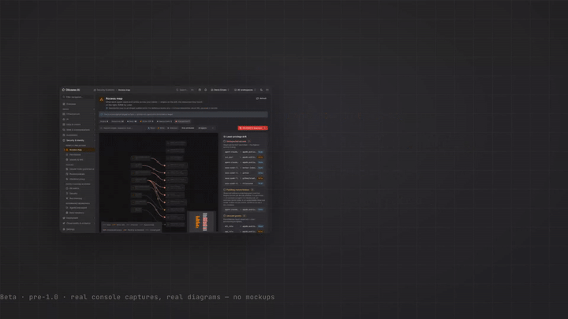
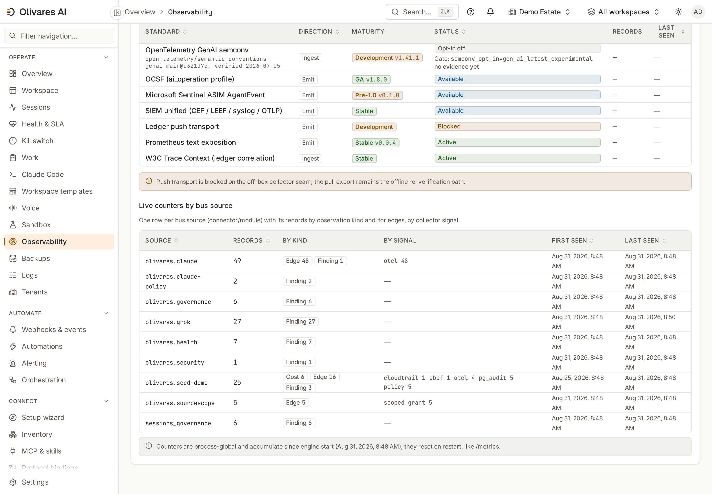
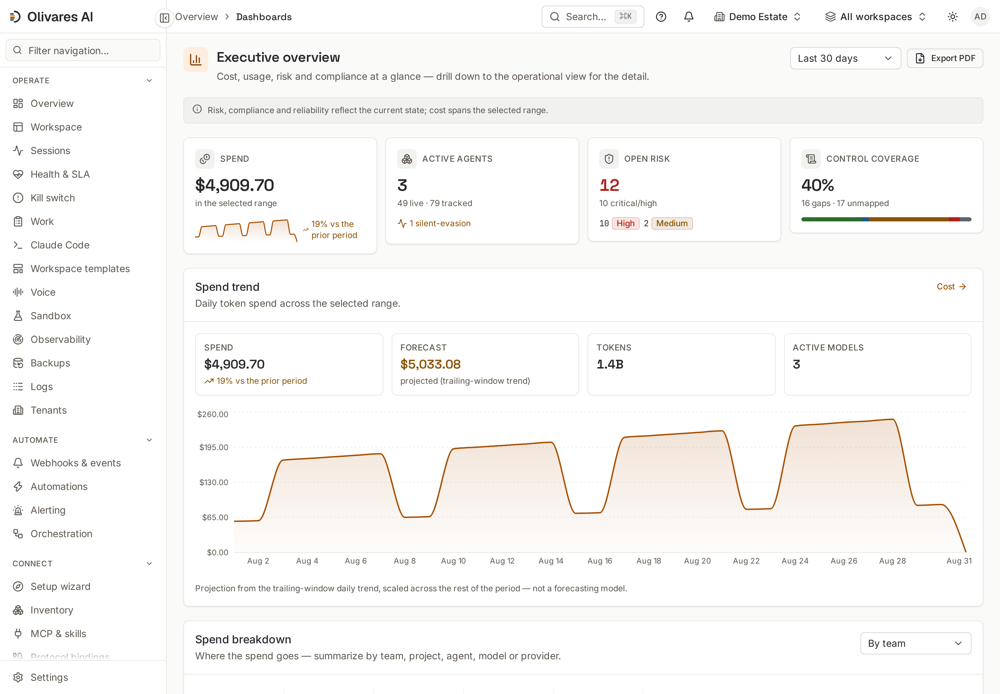
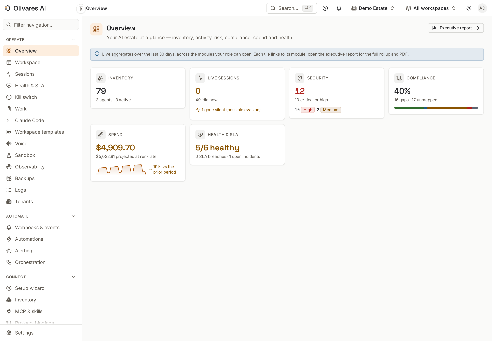
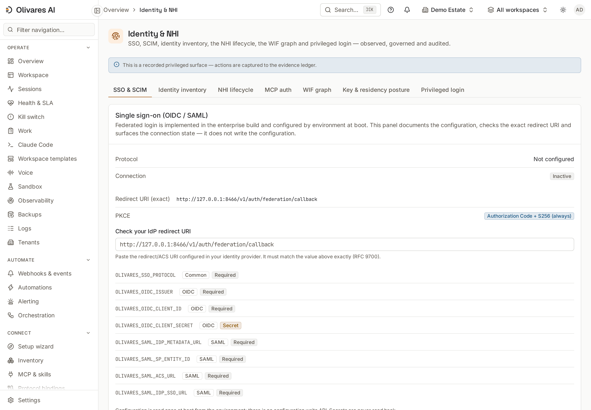
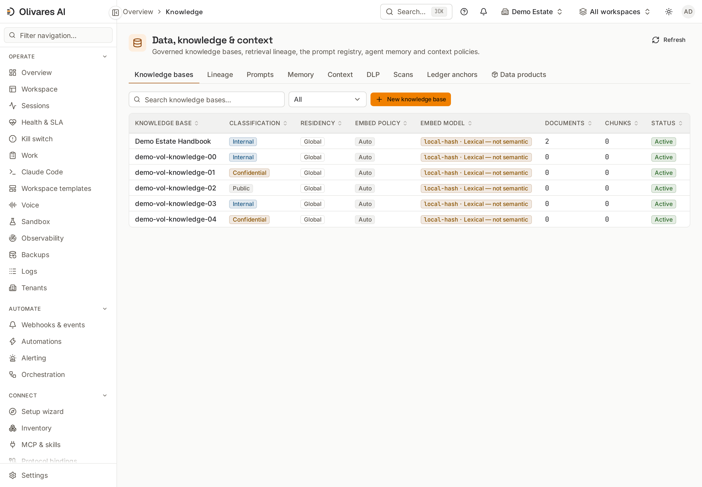
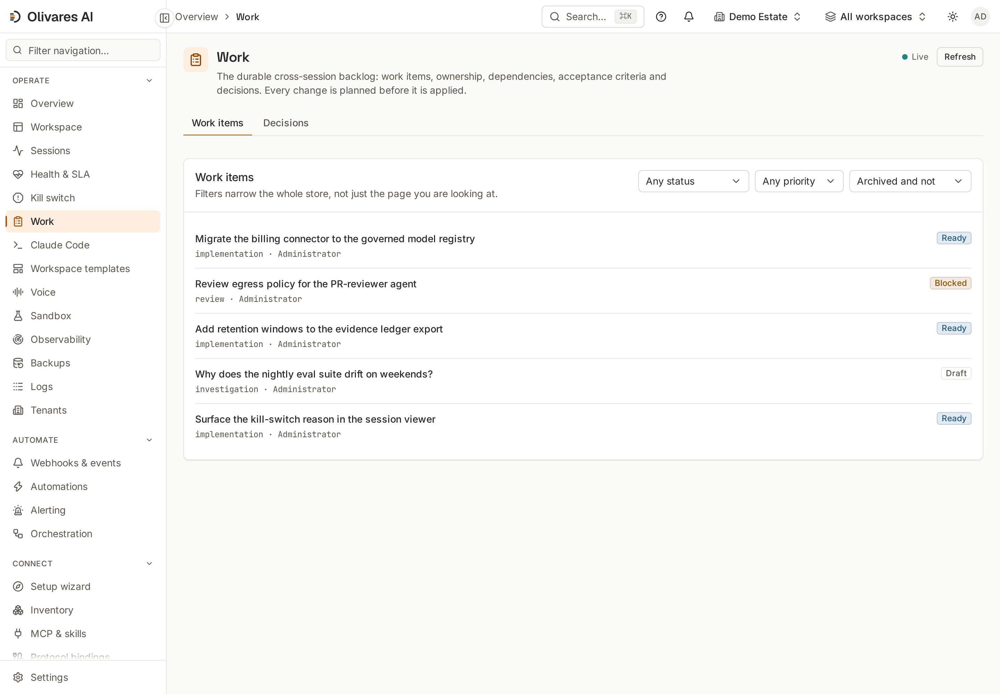

<div align="center">

<a href="https://olivares.ai"></a>

**Sprachen:** [English](./README.md) · [Español](./README.es.md) · [简体中文](./README.zh.md) · [Русский](./README.ru.md) · [日本語](./README.ja.md) · **Deutsch** · [Français](./README.fr.md)

**Die Control Plane für die KI, die Sie tatsächlich betreiben.** Integrieren Sie sie, setzen Sie sie für die Arbeit ein, verbinden Sie sie mit Ihren Systemen und steuern Sie jeden Teil davon — eine selbstgehostete Binary, vom Heimserver bis zum regulierten Unternehmen.

[Installation](#install) ·
[Schnellstart](#quickstart) ·
[Beispiele](examples/) ·
[Architektur](#architecture) ·
[Dokumentation](#documentation) ·
[Sicherheit](SECURITY.md) ·
[Mitwirken](CONTRIBUTING.md) ·
[olivares.ai](https://olivares.ai)

[](LICENSING.md)
[](LICENSING.md)
[](CHANGELOG.md)
[](CODE_OF_CONDUCT.md)

<!-- OpenSSF Best Practices Badge (self-certification).
     Registration at https://www.bestpractices.dev is pending (a maintainer action); the
     evidence map is in docs/openssf-badge.md. Once a project ID is assigned, uncomment:
[](https://www.bestpractices.dev/projects/PROJECT_ID)
-->

</div>

> Status: **beta**, in aktiver Entwicklung. Die Engine läuft Ende-zu-Ende — eine einzige statische Binary mit eingebetteter Konsole, die echte Signale aus den Systemen aufnimmt, in denen Ihre KI läuft. APIs, Schemas und die Modul-Oberfläche können sich vor 1.0 noch ändern, und einige Actuation-Seams (deklarierte, deny-closed Integrationspunkte) bleiben geschlossen, bis sie provisioniert sind (siehe [Ehrlichkeit & Grenzen](docs-site/src/content/docs/start/honesty-and-limits.md)). Releases werden aus diesem Repository erstellt; die [Installationspfade](#install) weiter unten werden mit dem ersten getaggten Release veröffentlicht.

> Lieferkette: Releases werden auf GitHub Actions mit einer signierten Vertrauenskette pro Artefakttyp gebaut — Archive werden mit SPDX-SBOMs und in-toto-Attestierungen ausgeliefert, Container-Images sind cosign-signiert mit einer Image-SBOM-Attestierung, und jedes Artefakt (Pakete und Chart eingeschlossen) ist vom cosign-signierten Checksums-Manifest abgedeckt, dazu ein OpenVEX-Dokument und SLSA-Build-Provenance für das Set. Verifizieren Sie jedes Release mit [`scripts/verify-release.sh`](scripts/verify-release.sh); die exakte Kette pro Artefakttyp, der air-gapped-Pfad und das Helm-Chart sind in [`docs/RELEASE-VERIFICATION.md`](docs/RELEASE-VERIFICATION.md) und [`deploy/`](deploy/) dokumentiert.

## Was Olivares AI ist

KI ist schon seit einiger Zeit nicht mehr nur ein Chatfenster. Was Sie heute tatsächlich betreiben, ist ein kleines Estate: Coding-Agenten in Terminals, MCP-Server, Modell-Endpunkte, Service-Accounts und geplante Jobs, verteilt über Maschinen, die nie dafür ausgelegt waren, ein einziges System zu sein. Nichts hält es zusammen, sodass die gewöhnlichen Fragen teuer zu beantworten sind: was läuft, wer es gestartet hat, was es erreicht hat, was es kostet und wer all dem zugestimmt hat.

**Olivares AI ist die Ebene, die es zusammenhält.** Sie hat zwei Hälften, die in derselben Binary ausgeliefert werden:

- **Ausführen und anbinden.** Eine dauerhafte Ebene für die Arbeit selbst: Work Items mit Eigentümerschaft, Abhängigkeiten, Akzeptanzkriterien und Entscheidungen; Leases, die aus Eigentümerschaft eine Autorität machen, die ein veralteter Inhaber nicht weiter nutzen kann; aus der Konsole gestartete, angehängte und gestoppte Sessions mit Eingaben für einen laufenden Run; Delegation an einen Remote-Peer über A2A; MCP als Tool-Oberfläche; und gesteuerte Content-Quellen für das Retrieval. Diese Hälfte wird unten unter [Die Arbeitsebene](#the-work-plane) beschrieben; der Status jeder Komponente wird klar benannt.
- **Sehen und steuern.** Inventar von allem Entdeckten, eine Read/Write Access Map dessen, was jeder Agent und jede Identität tatsächlich erreicht, Cedar-Richtlinien, deny-closed Durchsetzung, Budgets, die Ausgaben verweigern können, und ein hash-chained, signiertes Ledger, um das alles später nachzuweisen.

Keine der beiden Hälften ist Dekoration für die andere. Governance ohne Arbeitsebene ist ein Dashboard ohne etwas, worauf gehandelt werden kann; eine Arbeitsebene ohne Governance ist Arbeit, für die anschließend niemand Rechenschaft ablegen kann.

**Multi-Provider by design.** Claude Code ist auf der tiefsten Ebene integriert — der `PreToolUse`/`PostToolUse`-Hook, Managed Settings, Starten und Stoppen über die Konsole, Modellzugriff pro Subjekt — mit Codex und Grok Build daneben als erstklassige Befehlsoberflächen sowie gemini-cli, Cursor, opencode, goose, cline, OpenHands, OpenClaw und Hermes als eigene Connectors. Jeder davon gibt an, was er durchsetzen und was er nur beobachten kann; keiner ist das Gravitationszentrum des Produkts. Ollama und andere selbstgehostete Endpunkte werden über den lokalen Connector inventarisiert und attribuiert, der bewusst nur lesend ausgelegt ist; die Richtlinien- und Budgetregeln greifen dort, wo die Inferenz den gesteuerten Proxy passiert — der einzigen Stelle, an der sie überhaupt greifen können.

**Wer es betreibt.** Der offene Build bildet bei jeder dieser Größen die gesamte Plattform — die kommerziellen Add-ons sind additiver Code darauf, niemals ein anderes Produkt:

| Sie sind | So sieht das aus |
|---|---|
| **Ein Heimserver oder ein Homelab-Netzwerk** | eine Binary, SQLite, ein Docker-Volume, an Loopback gebunden, kein externer Dienst — die ausgelieferte Compose-Topologie läuft non-root und read-only innerhalb von 1 CPU und 1 GiB ([`deploy/compose/docker-compose.yml`](deploy/compose/docker-compose.yml)) |
| **Freelancer, Selbstständige oder Berater** | ein Tenant pro Kunde — jede Moduloperation ist an einen gebunden —, Budgets, die Ausgaben verweigern oder drosseln können, bevor sie auf der Rechnung erscheinen, und ein Posture-Export, den Sie übergeben können |
| **Eine Fachperson oder ein fortgeschrittener Nutzer** | dieselbe Engine, die ein Unternehmen betreibt, ohne dass etwas vorenthalten wird: Der offene Build ist die gesamte Plattform, sodass das, was Sie auf Ihrer eigenen Maschine lernen, genau das ist, was Sie bei der Arbeit betreiben |
| **Ein Engineering-Team oder KMU** | gemeinsame Work Items und Leases, sodass zwei Agenten (oder zwei Menschen) nicht gleichzeitig dasselbe Work Item innehaben können, SSO, Rollen und ein Audit Trail, den niemand von Hand zusammenstellen muss |
| **Ein reguliertes Unternehmen** | Postgres mit Row-Level Security, HA mit einem einzelnen Writer und Standbys, air-gapped Installationen, Nachweise, abgebildet auf **26 Framework-Kataloge**, und WORM-Archivierung auf einem unveränderlichen Substrat |

Jede Zeile ist derselbe Build. Mehrere dieser Fähigkeiten — SSO, HA, WORM-Archivierung, Budgets, die tatsächlich verweigern — sind Dinge, die Sie **provisionieren**, nicht Standardeinstellungen, die Sie beim ersten Start erhalten; die Matrix unten und [Ehrlichkeit & Grenzen](docs-site/src/content/docs/start/honesty-and-limits.md) sagen pro Fähigkeit, was jeweils gilt.

Es läuft als **einzelne, selbstgehostete Go-Binary** mit eingebetteter Konsole — auf Linux, Docker, Kubernetes, on-prem oder vollständig air-gapped. Es gibt keine verpflichtende Telemetrie und standardmäßig keinen Control-Plane-Egress: Ihren Perimeter überquert, was Sie dafür konfigurieren — Aufrufe an Ihre Modell-APIs, die SIEM-/Webhook-Ausgaben, die Sie verdrahten, ein externer Embedding-Provider, falls Sie einen provisionieren. Collectors lesen aus den Systemen, die Sie bereits betreiben (pgAudit, CloudTrail, eBPF, MCP, Ihr IdP), sodass ein ausfallender Collector niemals im Datenpfad der Produktion steht.

Abdeckung und Attribution tragen explizite Stufen (`firm`/`approximate`/`unknown`, `clean`/`lossy`/`opaque`), die Durchsetzung ist deny-closed, wo sie verdrahtet ist, und ein deklarierter Seam, wo nicht, und die Dokumentation sagt klar, was heute läuft und was sich im Design-Stadium befindet. Das Produkt erfindet keine Gewissheit, die es nicht beweisen kann — siehe [Ehrlichkeit & Grenzen](docs-site/src/content/docs/start/honesty-and-limits.md).

<div align="center">

<picture>
  <source media="(prefers-color-scheme: dark)" srcset="docs-site/public/console/access-map-dark.png">
  
</picture>

<sub><b>Zugriffskarte</b> — Was jeder Agent über Ihren Bestand hinweg liest und schreibt — Ursprünge links, die berührten Ressourcen rechts, R/RW nach Farbe.</sub>

</div>

**Sehen Sie es selbst in zwei Befehlen** (Go 1.26+, [Task](https://taskfile.dev), pnpm — [Voraussetzungen](#quickstart-prerequisites)):

```sh
task build
./bin/olivares serve --seed-demo --insecure --listen 127.0.0.1:8901 \
  --grpc-listen 127.0.0.1:8902 --data-dir "$(mktemp -d)"
# open http://127.0.0.1:8901 — inventory, work, orchestration, access map + drift, policies, FinOps
```

CI geht denselben Weg: `task smoke:quickstart` startet dieses Demo-Estate gegen die echte Binary und prüft seine Access-Map- und Drift-Zahlen ab. Für Installationspfade und ihre betrieblichen Standardeinstellungen siehe [Installation](#install) und [Schnellstart](#quickstart).

<a name="the-work-plane"></a>
<div align="center">
<picture>
  <source media="(prefers-color-scheme: dark)" srcset=".github/assets/04-environments-dark.svg">
  
</picture>

<sub>Derselbe Build vom Homelab bis zum regulierten Unternehmen.</sub>
</div>

## Die Arbeitsebene

Die Ebene, die die Arbeit trägt, ist der Teil von Olivares AI, den Agenten und Menschen teilen, und der Teil, der am häufigsten so beschrieben wird, als wäre er überall fertig. Das ist er nicht; daher folgt jede Komponente mit dem, was sie tatsächlich trägt, und der Reichweite, die sie heute hat.

| Komponente | Status | Wo sie lebt |
|---|---|---|
| **Work Items** — Briefing, Provenance, Abhängigkeiten, Akzeptanzkriterien, Entscheidungen, Eigentümer und Event-Verlauf, dauerhaft, mit einem Befehlsdokument, das REST, CLI und In-Process-Aufrufer teilen | **live, öffentliche API** | [`modules/sessions/work_model.go`](modules/sessions/work_model.go), Routen in [`modules/sessions/work_api.go`](modules/sessions/work_api.go) |
| **Leases** — Eigentümerschaft als abgegrenzte, ablaufende Autorität: erwerben, erneuern, freigeben, übernehmen, widerrufen; ein veralteter Inhaber kann nicht weiter handeln, und paralleler Erwerb hat genau einen Gewinner | **live, öffentliche API** | [`modules/sessions/work_lease.go`](modules/sessions/work_lease.go) |
| **Nachrichten, Bestätigungen und Übergaben** — dauerhafte, an ein Work Item gebundene Konversation mit Wiederholung und Zurückweisung veralteter Epochen | **live hinter einem Orchestrierungs-Workflow; der allgemeine öffentliche Posteingang ist absichtlich nicht verdrahtet** | [`modules/sessions/communication_model.go`](modules/sessions/communication_model.go); der Boot-Test, der die Verdrahtung der öffentlichen Ebene verbietet, ist [`cmd/olivares/communicationauthorityboot_test.go`](cmd/olivares/communicationauthorityboot_test.go) |
| **Start für Arbeit** — reservieren, den Lease übernehmen, *dann* die Session starten und Work/Epoche/Abgrenzung/Ausführung dauerhaft speichern, damit ein Wiederholungsversuch sicher ist | **live durch Orchestrierung** | [`modules/sessions/runtime_work_launch.go`](modules/sessions/runtime_work_launch.go) |
| **Remote-Ausführung über A2A** — Arbeit auf einem autorisierten Peer planen, testen, starten, beobachten und abbrechen, mit dauerhaften Quittungen | **live und nur, wenn ein Ziel konfiguriert ist**; ohne autorisiertes Ziel wird der Seam überhaupt nicht gemountet | [`cmd/olivares/wire.go`](cmd/olivares/wire.go), [`cmd/olivares/orchremote.go`](cmd/olivares/orchremote.go) |
| **Shadow-Modus und finale Autorität** — Dual-Reporting gegen das bestehende System und einen Komparator, bevor die Ebene maßgeblich wird | **nicht gebaut** | nur Design |

Lesen Sie diese Tabelle als die ehrliche Version von „Agenten, die miteinander sprechen“: Work Items und Leases sind gewöhnliche API-Oberflächen, die Sie heute ansteuern können; die Konversation zwischen Agenten ist real und dauerhaft, aber auf einen Orchestrierungs-Workflow begrenzt, und es gibt keinen allgemeinen Nachrichtenbus für beliebige Agenten; Remote-Delegation funktioniert und verweigert unbekannte Peers. Was nicht existiert, ist nicht im Interface als „kommt bald“ aufgeführt — es wird hier als abwesend aufgeführt.

<div align="center">
<picture>
  <source media="(prefers-color-scheme: dark)" srcset=".github/assets/03-agent-communication-dark.svg">
  
</picture>

<sub>Agenten teilen sich eine dauerhafte Arbeitsebene. Was nicht gebaut ist, wird als abwesend gezeichnet.</sub>
</div>

## Was es abdeckt

Eine Binary, **30 Module**, eine Konsole — über den gesamten Fußabdruck Ihrer KI hinweg, nicht nur ein einzelnes Feature. Jede Fähigkeit trägt einen expliziten Reifezustand — live, on-demand, beobachtet oder ein deklarierter deny-closed Seam — pro Punkt angegeben in [Ehrlichkeit & Grenzen](docs-site/src/content/docs/start/honesty-and-limits.md).

- **Die Arbeit ausführen.** Dauerhafte Work Items, Leases, orchestrierter Start und A2A-Delegation wie in [Die Arbeitsebene](#the-work-plane) beschrieben; die Work-Ansicht der Konsole ist die Operator-Oberfläche für denselben Store, und die Orchestration-Ansicht zeichnet die Delegationstopologie aus beobachteten Signalen.
- **Sehen Sie es.** Inventar jedes **entdeckten** Agenten, jeder Session, jedes Modells, jedes MCP-Servers, jedes Tools und jeder Identität — die Abdeckung folgt dem, was Sie anbinden, trägt explizite Indikatoren und markiert, was sie nicht sehen kann, als `unknown`, statt zu raten; eine Read/Write **Access Map** dessen, was jedes davon tatsächlich erreicht, mit einer Permitted-vs-Observed **Drift**-Ansicht; Live-Sessions, der Orchestrierungsgraph, Health und SLA.
- **Steuern & durchsetzen.** Eine Cedar-Autorisierungs-Engine (RBAC + Deny-Overlay + positive scoped Grants) und **vier deny-closed Enforcement Points** — der Claude Code `PreToolUse`/`PostToolUse`-Hook, ein Inline-`/v1/messages`-Inferenz-Proxy, ein MCP-`tools/call`-Gate und ein A2A-Delegation-Gate — sodass unautorisierte Aktionen nicht ausgeführt werden: Sie werden blockiert, an eine Vier-Augen-Freigabe gesendet oder umgeschrieben, bevor sie laufen. Dieses Adjektiv ist gemessen, nicht behauptet: Ein Punkt zählt nur, solange ein Test seinen *unkonfigurierten* Pfad durchläuft — kein Gate verdrahtet, ein leeres Richtliniendokument, ein Policy-Store, der nicht antwortet — und die Verweigerung prüft. Das Verzeichnis der Paare aus Seam und Nachweis ist [`scripts/enforcement-seams.tsv`](scripts/enforcement-seams.tsv); wird ein Nachweis entfernt, sinkt die Zahl und der Build schlägt fehl. Die Richtlinie reicht bis in die Session selbst: Allow/Ask/Deny-Regeln pro Pfad und pro Teilbaum im Hook, Context-Window-Budgets pro Oberfläche und pro Gruppe sowie Source-Scoping bis hinunter auf Session, Agent, Benutzer, Gruppe oder Rolle. Dazu scoped Admin und benutzerdefinierte Rollen, Break-Glass mit Dual Control und ein Estate-**Kill-Switch**, der fail-closed arbeitet.
- **Claude & das Agenten-Ökosystem.** Claude Code im Hook steuern; Claude-Code-Sessions und ihren Workspace aus der Konsole starten, sich daran anhängen, steuern und stoppen; Enterprise-Managed-Settings ausliefern; steuern, welches Modell jedes Subjekt verwenden darf, auf welcher Oberfläche; MCP (OAuth-gated Resource Server, Posture, Registry, `.mcpb`); A2A v1 zwischen autorisierten Peers; sowie Oberflächen für die Agenten, die Ihre Teams tatsächlich einsetzen — gemini-cli, Cursor, Codex CLI, opencode, goose, cline, OpenHands, OpenClaw und Hermes (Durchsetzung, wo die jeweilige Oberfläche sie bereitstellt, Read-only-Posture-Beobachtung, wo nicht; jeder Connector gibt an, welches von beiden gilt) — plus Teams-Benachrichtigungen mit Freigabe-Deep-Links.
- **Gesteuert speisen.** Die Kontext-Seite derselben Medaille: Content-Quellen (SharePoint, Confluence, Google Drive, Notion, Salesforce, Snowflake, S3, Azure AI Search, SAP OData, PostgreSQL, plus eine auf ein Root-Verzeichnis beschränkte Filesystem-Quelle für lokale/NFS/SMB-Mounts) speisen eine gesteuerte RAG-Pipeline mit funktionierenden Defaults — lexikalisches Zero-Egress-Retrieval out of the box, model-backed semantisches Retrieval, wenn Sie einen Embedding-Provider provisionieren (Voyage, OpenAI-kompatibel oder self-hosted; `embed_policy=model_backed` verweigert nach dem Fail-closed-Prinzip, statt stillschweigend zu degradieren), Provenance pro Quelle, Clearance und Scoping deny-closed zum Retrieval-Zeitpunkt durchgesetzt — plus ein Data-Product-Katalog mit versionierten Verträgen und Quality-Gates. Siehe [Governed data for Claude](docs-site/src/content/docs/how-to/governed-data-for-claude.md).
- **Identität & Zugriff.** Menschliche Identität (WebAuthn/FIDO2, PIV/CAC, AAL-Step-up) und der Lebenszyklus **nicht-menschlicher Identität**; Föderation von Agenten-Identitäten (Entra Agent ID, AWS AgentCore, Google, SPIFFE/SPIRE); Roster-Abgleich aus AD/LDAP/Okta/Entra/Vault/Infisical mit SCIM.
- **Daten absichern.** Inline-Guardrails (PII, Prompt-Injection, Jailbreak), DLP-Egress, BYOK/CMEK-Envelope-Verschlüsselung über drei KMS-Backends (AWS KMS, Google Cloud KMS, Azure Key Vault), Aufzeichnung privilegierter Sessions, Recht auf Löschung mit verifiziertem Key-Shredding, Aufbewahrung und Legal-Hold, Residency-Attestierung sowie hybride Post-Quantum-Schlüsseletablierung in TLS 1.3 (X25519MLKEM768, wenn die Gegenstelle es unterstützt; Signaturen bleiben heute klassisch).
- **Beweisen Sie es.** Ein hash-chained, Ed25519-signiertes Audit-Ledger; versiegelte, append-only Compliance-Nachweise, abgebildet auf **26 Framework-Kataloge** (EU AI Act, NIST AI RMF, ISO 42001, SOC 2, ISO 27001, GDPR…); SIEM/ITSM-Push (CEF/LEEF/syslog/OTLP/OCSF).
- **Gut betreiben.** FinOps-Budgets, die Ausgaben verweigern oder drosseln können; kalibrierte LLM-Judge-Evals mit einem blockierenden CI-Gate (on-demand — ohne Judge-Credential melden Läufe `SKIPPED`, niemals ein stilles Bestehen); OS-isolierte Red-Team-Sandboxes (gVisor/Firecracker; ohne provisionierte Sandbox melden Läufe `DEGRADED`, niemals ein fabriziertes Bestehen); ein Connector-Health-Dashboard mit öffentlicher Statusseite; Backups und Wiederherstellung, verwaltet aus der Konsole.

Über **158 Integrationen** hinweg mit den Clouds, Verzeichnissen, Secrets-Stores, Modellanbietern, Agenten-Oberflächen, SIEMs und Pipelines, die Sie bereits betreiben — eine Zahl, die aus dem Code abgeleitet und bei jedem Push von [`scripts/check-public-counts.sh`](scripts/check-public-counts.sh) erzwungen wird. Die Einheit ist das Connector-Verzeichnis, das Go-Code enthält: Von den 159 Verzeichnissen im Baum qualifizieren sich 158, und das Gate leitet die Zahl bei jedem Push auf diese Weise her. Zwölf davon sind gemeinsam genutzte Contract-/Bibliothekspakete statt Fähigkeiten — sie werden mitgezählt, und [`connectors/README.md`](connectors/README.md) enthält die vollständige Aufschlüsselung, was jedes Verzeichnis ist. Die vollständige Karte jeder Fähigkeit und ihrer Reife findet sich in [`docs-site/`](docs-site/), und ihre eigene Test-Suite sichert sie ab.

<a name="whats-open-whats-enterprise-whats-planned"></a>
## Was offen ist, was enterprise ist, was geplant ist

Diese Tabelle ordnet jeden Fähigkeitsbereich dem Ort zu, an dem er ausgeliefert wird — dem offenen (AGPL-)Build oder einem der separaten, optionalen kommerziellen Add-ons; die Reife pro Fähigkeit wird in [Ehrlichkeit & Grenzen](docs-site/src/content/docs/start/honesty-and-limits.md) ehrlich angegeben. Die vollständige Liste der reservierten Seams ist im öffentlichen Baum selbst deklariert ([`cmd/olivares/wire_noenterprise.go`](cmd/olivares/wire_noenterprise.go)): Eine Fähigkeit, die die offene Binary reserviert, antwortet mit `501` oder ist ein No-op, und ihr Kommentar sagt das auch — nichts ist versteckt, und nichts Offenes wird entfernt.

| Bereich | Offen (AGPL) | Kommerzielle Add-ons | Geplant |
|---|---|---|---|
| Arbeit & Orchestrierung | dauerhafte Work Items (Briefing, Abhängigkeiten, Akzeptanz, Entscheidungen, Events), abgegrenzte Leases mit Übernahme und Widerruf, orchestrierter Start von Sessions gegen ein Work Item, mit work-fenced Eingabe und Stopp in der Sessions-API; Delegation via A2A an autorisierte Peers mit dauerhaften Quittungen, workflow-begrenzte Nachrichten/Bestätigungen/Übergaben, Work- und Orchestration-Ansichten der Konsole | — | Shadow-Dual-Reporting und der Autoritätsschalter, der diese Ebene zum System of Record macht |
| Sichtbarkeit | Inventar von Agenten/Sessions/Modellen/MCP-Servern/Tools/Identitäten, Read/Write Access Map mit Permitted-vs-Observed Drift, Live-Sessions, Orchestrierungsgraph, Health/SLA | — | — |
| Richtlinien & Durchsetzung | Cedar-Autorisierungs-Engine (RBAC + Deny-Overlay + scoped Grants), vier deny-closed Enforcement Points (Claude-Code-Hook, Inline-`/v1/messages`-Proxy, MCP-`tools/call`-Gate, A2A-Delegation-Gate), Vier-Augen-Freigaben, Break-Glass mit Dual Control, Estate-Kill-Switch | Hook-Härtung, Server-Tool-Egress-Kontrolle, Computer-Use-Governance-Gate, MCP-Tool-Definition-Pins (deny-closed bei geänderter Definition), automatischer Circuit Breaker mit Kill-Switch-Eskalation | — |
| Claude & das Agenten-Ökosystem | Claude Code im Hook gesteuert, Starten/Anhängen/Steuern/Stoppen von Claude-Code-Sessions aus der Konsole, Auslieferung von Enterprise-Managed-Settings, Modellzugriff pro Subjekt/pro Oberfläche, MCP (OAuth-gated Resource Server, Posture, Registry, `.mcpb`), A2A v1, Oberflächen für gemini-cli/Cursor/Codex CLI/opencode/goose/cline/OpenHands/OpenClaw/Hermes (Durchsetzung, wo die Oberfläche sie bereitstellt, Posture-Beobachtung, wo nicht), Teams-Benachrichtigungen mit Freigabe-Deep-Links | Content-Inspektion beim MCP-App-Rendering, Elicitation-/Sampling-Mediation | — |
| Kontext & Wissen | zehn Live-Content-Quellen (SharePoint, Confluence, Google Drive, Notion, Salesforce, Snowflake, S3, Azure AI Search, SAP OData, PostgreSQL) plus eine auf ein Root-Verzeichnis beschränkte Filesystem-Quelle (lokale/NFS/SMB-Mounts), gesteuertes RAG (lexikalisches Retrieval per Default, model-backed semantisches mit provisioniertem Embedder — verweigert unter `embed_policy=model_backed` nach dem Fail-closed-Prinzip) mit deny-closed Clearance zum Retrieval-Zeitpunkt, Provenance pro Quelle, Data-Product-Katalog mit versionierten Verträgen und Quality-Gates | — | — |
| Identität & Zugriff | Single-IdP-SSO (OIDC + SAML 2.0), WebAuthn/FIDO2, PIV/CAC, AAL-Step-up, Lebenszyklus nicht-menschlicher Identitäten, Föderation von Agenten-Identitäten (Entra Agent ID, AWS AgentCore, Google, SPIFFE/SPIRE), Roster-Abgleich (AD/LDAP/Okta/Entra/Vault/Infisical) mit SCIM, CAEP-Event-Receiver | Multi-IdP-Föderation, SSO-Erzwingung, Managed SCIM, CyberArk-Conjur-NHI-Rotation, CAEP-Transmitter (signierte SETs an SSF-Receiver) | — |
| Datensicherheit | Inline-Guardrails (PII, Prompt-Injection, Jailbreak), DLP-Egress, BYOK/CMEK über drei KMS-Backends (AWS KMS, Google Cloud KMS, Azure Key Vault), Aufzeichnung privilegierter Sessions, Recht auf Löschung mit verifiziertem Key-Shred, Aufbewahrung und Legal-Hold, Residency-Attestierung, hybride PQC-Schlüsseletablierung in TLS 1.3 (X25519MLKEM768) | Content-Firewall/DLP | — |
| Nachweise & Compliance | hash-chained, Ed25519-signiertes Audit-Ledger, versiegelte append-only Nachweise, 26 Framework-Kataloge, dir/S3-Archiv mit Export/Verify (dir ist nur auf einem unveränderlichen Substrat WORM; S3 verwendet Object Lock), OSCAL-Export (drei offene Modelle), offene DORA-ICT-Risiko-Ansicht, SIEM/ITSM-Push (CEF/LEEF/syslog/OTLP/OCSF) | OSCAL-Profile-/SSP-Ingestion + POA&M-Builder, regulatorische Aufbewahrungsuntergrenzen + Compliance-Mode-Lock (SEC 17a-4/FINRA 4511/CFTC 1.31), DORA-Register-of-Information + Major-Incident-Berichte, langfristige WORM-Legal-Holds + Nachweispakete in Prüferqualität, Azure-/GCS-WORM-Sinks, ISO 42001 AIMS pack, Compliance-Depth- + NIS2-Klassifizierungs-Packs, Enterprise-Reporting | — |
| Betrieb | FinOps-Budgets, die Ausgaben verweigern oder drosseln, kalibrierte LLM-Judge-Evals mit blockierendem CI-Gate (on-demand: Judge-Credential erforderlich, sonst `SKIPPED`), OS-isolierte Red-Team-Sandboxes (gVisor/Firecracker; nicht provisionierte Läufe melden `DEGRADED`), Connector-Health-Dashboard mit öffentlicher Statusseite, aus der Konsole verwaltete Backups und Wiederherstellung, offene Attack-Path-Abfragen | kompilierter Threat-Intel-Katalog, Incident-Close-Loop | — |
| Plattform & Deployment | einzelne statische Binary mit eingebetteter Konsole, SQLite oder Postgres mit Row-Level Security, Docker/Kubernetes/Helm/air-gapped, Terraform-Provider, generierte Client-SDKs (Go, Java, Python, TypeScript), offener In-Proc-Bus + Core-NATS-Bridge | durabler JetStream-Bus (at-least-once + Dedup) | Windows-Pakete (heute: Linux-Container oder Build aus dem Quellcode), Modell-Fine-Tuning nach v1, Voice-Telemetrie-Probe (heute ein deklarierter deny-closed Seam) |

Der AGPL-Build ist die ganze Plattform und wird nie von innen per Feature-Cap begrenzt. Die kommerziellen Add-ons sind additiver neuer Code, niemals aus dem offenen Produkt entfernte Features. Ein Abonnement ist das Credential, mit dem Sie signierte Artefakte herunterladen — das SUSE-Modell — und kein Schlüssel, der Code entsperrt, der bereits auf Ihrer Festplatte liegt. Benutzerkonten sind in der selbstgehosteten Engine unbegrenzt: Keine ihrer Editionen erzwingt ein Seat-Limit, und der Seat-Seam der Binary ist ein bedingungsloser No-op. Die gehostete Cloud-Stufe ist die einzige Ausnahme — ihre Control Plane verwaltet Seats pro Tenant; das ist eine Eigenschaft dieses Dienstes und nicht dieser Binary. Siehe [`LICENSING.md`](LICENSING.md) und [Ehrlichkeit & Grenzen](docs-site/src/content/docs/start/honesty-and-limits.md).

<div align="center">
<picture>
  <source media="(prefers-color-scheme: dark)" srcset=".github/assets/05-editions-dark.svg">
  
</picture>

<sub>Editionen nach Zusammensetzung. Paketierung und Preise auf Anfrage.</sub>
</div>

## Ein Blick in die Konsole

<div align="center">



<sub>Ein paar Sekunden der echten Konsole. Jedes Standbild unten ist ein Capture des bestückten Demo-Estates, ausgeliefert von der laufenden Binary — regenerieren Sie die Roh-Captures selbst mit <code>bash scripts/docs-captures.sh</code> (das kuratierte Set hier ist aus dessen Output ausgewählt).</sub>

</div>

| | |
|---|---|
| <picture><source media="(prefers-color-scheme: dark)" srcset="docs-site/public/console/access-map-drift-dark.png"></picture><br><sub><b>Abweichung der geringsten Rechte</b> — Den Abgleich der geringsten Rechte überlagern: unerwarteten Zugriff (beobachtet, nicht gestattet) und ungenutzte Gewährungen hervorheben.</sub> | <picture><source media="(prefers-color-scheme: dark)" srcset="docs-site/public/console/orchestration-dark.png"></picture><br><sub><b>Orchestrierung &amp; A2A</b> — Agent-zu-Agent-Topologie — wer an wen delegiert, die laufenden Delegationsflüsse und die deklarierten Kadenzen. Lesezugriffe auf den Kommunikationsgraphen sind privilegiert und werden selbst auditiert.</sub> |
| <picture><source media="(prefers-color-scheme: dark)" srcset="docs-site/public/console/inventory-dark.png"></picture><br><sub><b>Inventar</b> — Jeder Agent, jede Sitzung, jeder MCP, jedes Modell und jede Identität, die in Ihrem Bestand erkannt wurden.</sub> | <picture><source media="(prefers-color-scheme: dark)" srcset="docs-site/public/console/observability-dark.png"></picture><br><sub><b>Beobachtbarkeit &amp; Interoperabilität</b> — Standardbasierte Erfassungszustände und Hauptbuch-korrelierte Trace-Detailanalyse. Die Kennzahlen gelten engine-weit (prozessglobal), nicht pro Mandant; Standards sind auf die Versionen und Reifegrade festgelegt, die die zuständigen Gremien deklarieren.</sub> |
| <picture><source media="(prefers-color-scheme: dark)" srcset="docs-site/public/console/dashboards-dark.png"></picture><br><sub><b>Führungsübersicht</b> — Kosten, Nutzung, Risiko und Compliance auf einen Blick — für die Details zur operativen Ansicht wechseln.</sub> | <picture><source media="(prefers-color-scheme: dark)" srcset="docs-site/public/console/home-dark.png"></picture><br><sub><b>Übersicht</b> — Ihr KI-Bestand auf einen Blick — Inventar, Aktivität, Risiko, Compliance, Ausgaben und Zustand.</sub> |
| <picture><source media="(prefers-color-scheme: dark)" srcset="docs-site/public/console/security-dark.png"></picture><br><sub><b>Sicherheit &amp; Forensik</b> — Befunde der Schutzleitplanken, die Durchsetzungslage, die Anomalie-Warteschlange und manipulationssichere Vorfallforensik. Die Ebene ist standardmäßig detektivisch — sie zeichnet auf, sie blockiert nicht von sich aus, sofern die Durchsetzung nicht aktiviert und gesteuert ist.</sub> | <picture><source media="(prefers-color-scheme: dark)" srcset="docs-site/public/console/session-viewer-dark.png"></picture><br><sub><b>Viewer für Sitzungsaufzeichnungen</b> — Einheitliche Zeitachse der Agentenaktivität und Governance-Nachweise für eine einzelne Sitzung.</sub> |
| <picture><source media="(prefers-color-scheme: dark)" srcset="docs-site/public/console/identity-dark.png"></picture><br><sub><b>Identität &amp; NHI</b> — SSO, SCIM, Identitätsinventar, NHI-Lebenszyklus, WIF-Graph und privilegierte Anmeldung — beobachtet, gesteuert und auditiert.</sub> | <picture><source media="(prefers-color-scheme: dark)" srcset="docs-site/public/console/knowledge-dark.png"></picture><br><sub><b>Daten, Wissen &amp; Kontext</b> — Governance-konforme Wissensdatenbanken, Abruf-Herkunft, das Prompt-Register, Agent-Speicher und Kontextrichtlinien.</sub> |
| <picture><source media="(prefers-color-scheme: dark)" srcset="docs-site/public/console/work-apply-refused-dark.png"></picture><br><sub><b>Plan</b> — Die Änderung wird geplant. In diesem Schritt wird nichts geschrieben.</sub> | <picture><source media="(prefers-color-scheme: dark)" srcset="docs-site/public/console/killswitch-dark.png"></picture><br><sub><b>Not-Aus</b> — Die Notabschaltung des Bestands: Ein Klick stoppt jede gesteuerte Aktuierungsoberfläche. Das Auslösen ist bewusst niederschwellig; die Wiederherstellung erfordert zwei unterschiedliche Benutzerkonten und eine erzwungene Nachprüfung.</sub> |

<a name="install"></a>
## Installation

Jedes Release wird unter einer **cosign-signierten Vertrauenskette** ausgeliefert — ein cosign-signiertes Checksums-Manifest, das jedes Artefakt abdeckt und über das Archive und statische Binaries mittelbar abgedeckt sind, je Archiv eine SBOM-in-toto-Attestierung, cosign-Signaturen direkt auf dem Container-Image — mit einer SBOM-Attestierung für das Container-Image — und auf dem Helm-Chart und SLSA-Build-Provenance für den gesamten Satz. Bei einem Sicherheitsprodukt ist die Lieferkette Teil des Vertrauensmodells, also [verifizieren Sie es](docs/RELEASE-VERIFICATION.md), bevor Sie es ausführen. Die vollständige Matrix pro Betriebssystem und das Produktions-Setup finden sich in [`INSTALL.md`](INSTALL.md); die Deployment-Tutorials (Compose, Kubernetes/Helm, air-gapped) finden sich in [`docs-site/`](docs-site/).

Die Engine ist **secure by default**: sie bindet an Loopback, liefert beim ersten Start HTTPS mit einem selbstsignierten Zertifikat aus, kommt ohne Standard-Zugangsdaten und gibt ein Einmal-Setup-Token an die Konsole aus. Der erste Befehl, den Sie ausführen, ist der sichere.

**Aus dem Quellcode** (der unterstützte Pfad bis zum ersten getaggten Release):

```sh
# Build the single binary (Go 1.26+, Task, pnpm — the web console is embedded).
task build

# Start it — one guided, secure-by-default command (TLS on, loopback-only, no
# default credentials). It prints your console URL and a one-time setup token.
./bin/olivares quickstart
```

**Mit dem ersten Release** wird der empfohlene Pfad zu einer einzigen verifizierten Installation — `.deb`/`.rpm`/`.apk`-Pakete mit einer gehärteten systemd-Unit, ein Multi-Arch-Docker-Image, ein Homebrew-Cask und ein Helm-Chart, jeweils vom cosign-signierten Checksums-Manifest des Releases abgedeckt (Images direkt signiert), jeweils in einem Schritt installierbar und weiterhin secure by default. Diese sind noch nicht veröffentlicht; bis der Tag erscheint, bauen Sie wie oben aus dem Quellcode. **Windows** ist noch nicht gebaut — führen Sie den Linux-Container aus oder bauen Sie aus dem Quellcode ([Plan in `INSTALL.md`](INSTALL.md#windows)).

> Möchten Sie sich zuerst umsehen, ohne echte Quellen zu verdrahten? Ein synthetisches Estate läuft mit einem Befehl auf Loopback — siehe [Schnellstart](#quickstart) unten.

<a name="quickstart"></a>
## Schnellstart

Zwei Einstiege: ein synthetisches Estate sofort erkunden oder die Engine auf eine echte Quelle richten. Beide führen dieselbe echte Binary aus.

### In fünf Minuten evaluieren

1. Bauen Sie mit `task build` (Go 1.26+, Task, pnpm; siehe [Voraussetzungen](#quickstart-prerequisites)).
2. Starten Sie das Demo-Estate mit dem exakten Befehl aus Schritt 2a unten.
3. Prüfen Sie in der Konsole die Access Map und ihre Permitted-vs-Observed Drift (20 Knoten / 13 Kanten, mit 8 unerwarteten Zugriffen und 2 ungenutzten Grants), eine Cedar-Richtlinie und einen Freigabefluss, die Compliance-Nachweisansicht (26 Framework-Kataloge) und ein FinOps-Budget.
4. Lesen Sie dann, was real ist und was geplant ist: die Fähigkeitsmatrix oben, [Die Arbeitsebene](#the-work-plane) und [Ehrlichkeit & Grenzen](docs-site/src/content/docs/start/honesty-and-limits.md).

<a name="quickstart-prerequisites"></a>
Voraussetzungen für das Bauen aus dem Quellcode: Go 1.26+, [Task](https://taskfile.dev) (go-task) und pnpm (die Web-UI ist eingebettet). Siehe [`CONTRIBUTING.md`](CONTRIBUTING.md) für das vollständige Entwicklungs-Setup.

**1. Build:**

```sh
task build && ./bin/olivares version
```

**2a. Das Demo-Estate erkunden** — synthetische Beobachtungen durch die echte Engine, nur Loopback (sie weist Nicht-Loopback-Adressen zurück), keine echten Daten:

```sh
./bin/olivares serve --seed-demo --insecure \
  --listen 127.0.0.1:8901 --grpc-listen 127.0.0.1:8902 \
  --data-dir "$(mktemp -d)"
```

Öffnen Sie `http://127.0.0.1:8901`, melden Sie sich mit den Demo-Zugangsdaten aus dem Boot-Banner an und gehen Sie durch die Konsole — Inventar, die Access Map und ihre Drift, Sessions, Orchestrierung, Richtlinien, FinOps, Compliance. Der Demo-Seed dient nur zum Lernen (Passwort aus dem öffentlichen Quellbaum); richten Sie ihn niemals auf echte Daten.

**2b. Oder echt starten** — ein geführter, secure-by-default Befehl:

```sh
./bin/olivares quickstart        # TLS on, loopback; prints the console URL + a one-time setup token
```

Öffnen Sie die Konsole unter der ausgegebenen URL und legen Sie mit dem Token Ihren ersten Administrator an — kein curl, keine zusätzlichen Schritte. (`olivares serve` ist dieselbe Engine mit expliziten Flags, für Produktion und Container.) Verbinden Sie dann eine Quelle. Der [vollständige Schnellstart](docs-site/src/content/docs/start/quickstart.md) verdrahtet einen **echten pgAudit-Connector** gegen ein PostgreSQL-Audit-Log — kein Demo-Seed — und verlinkt die Produktions-Installationspfade (systemd, Docker Compose, Kubernetes via [`deploy/manifests/install.yaml`](deploy/manifests/install.yaml), air-gapped).

Das Demo-Estate ist deterministisch. Die Zahlen sind nicht aspirational — `task smoke:quickstart` geht genau diesen Weg gegen die echte Binary (mit eigenen Ports und eigenem Datenverzeichnis) und prüft die oben genannten Access-Map- und Drift-Zahlen ab, sodass dieser Abschnitt nicht stillschweigend vom Code abweichen kann.

<a name="architecture"></a>
## Architektur

<div align="center">
<picture>
  <source media="(prefers-color-scheme: dark)" srcset=".github/assets/02-architecture-dark.svg">
  
</picture>
</div>

Die Engine ist eine einzige statische Go-Binary (`olivares`), die die Web-UI einbettet und ihre Fähigkeiten über vier Oberflächen mit jeweils dokumentierter Abdeckung bereitstellt: eine REST-API (die primäre Oberfläche), einen fokussierten, eingefrorenen gRPC-Spiegel des stabilen Kerns, die `olivares` CLI selbst — 68 gruppierte Befehle der obersten Ebene, von `quickstart` und `serve` bis `work`, `orchestration`, `agent`, `mcp` und `compliance`, mit einem Test, der die Gesamtzahl der Hilfegruppen bewahrt, damit kein neuer Befehl ohne Gruppierung landen kann — und einen Terraform-Provider für die Manage-as-Code-Ressourcen. Collectors laufen innerhalb der Infrastruktur des Kunden in drei Modi: als In-Process-Fast-Path-Quellen, als Out-of-Process-Plugins, die die Engine über einen authentifizierten Kanal pro Start (AutoMTLS) überwacht, und als Opt-in-Remote-Deployment Collector→Core über verifizierte-Client-Zertifikat-mTLS. Der Core speichert Daten in SQLite (Single-Node, air-gap) oder Postgres mit Row-Level Security, wobei jede Moduloperation in der Store-API an einen Tenant gebunden ist und Postgres dies mit FORCE Row-Level Security erneut erzwingt. Die Anwendungsrolle wird beim Booten abgewiesen, wenn sie privilegiert genug ist, dies stillschweigend zu umgehen (Superuser oder `BYPASSRLS`), und der einzige Weg an der Abweisung vorbei ist ein ausdrückliches Opt-in-Flag, das benennt, was es kostet. Systemlesezugriffe über Tenant-Grenzen hinweg laufen über einen separaten `BYPASSRLS`-Admin-Pool mit minimalen Rechten, der niemals für tenantbezogene Arbeit genutzt wird — eine deklarierte Tür, nicht die Abwesenheit einer solchen.

Überblick: [`ARCHITECTURE.md`](ARCHITECTURE.md).

## Open Core, nach Verzeichnis

Die Lizenzierung steht ab dem ersten Commit fest: **Open Core** — das vollständige Produkt unter AGPL, ein permissives SDK und Connectors, damit das Ökosystem ohne Copyleft-Reibung wachsen kann, und einen kleinen Satz **additiver** kommerzieller Add-ons — ausschließlich mit `-tags enterprise` gebaut, jedes separat zu kommerziellen Bedingungen lizenziert und in der öffentlichen Binary nicht enthalten — für die reservierten Fähigkeiten. Der AGPL-Build ist die gesamte Governance-Plattform und wird niemals beschnitten, um zum Upgrade zu drängen; die kommerziellen Add-ons *fügen* neuen Code hinzu, der nie Teil des offenen Produkts war — sodass ein Enterprise-Build nicht mit dem offenen identisch ist, während dem, was offen ausgeliefert wird, nichts genommen wird. Jede Quelldatei trägt einen `SPDX-License-Identifier`-Header, durchgesetzt in CI.

| Verzeichnis | Lizenz | Inhalt |
|---|---|---|
| `core/` | `AGPL-3.0-only` | Engine: Ingest, Event-Bus, Datenmodell, Modul-Runtime, API, authn/z, Audit, Mandantenfähigkeit |
| `modules/` | `AGPL-3.0-only` | Die 30 Produktmodule (Inventar, Access Map, Work und Leases, Identität, FinOps, Evals, Guardrails, …) |
| `web/` | `AGPL-3.0-only` | React-UI, via `go:embed` in die Binary eingebettet |
| `sdk/` | `Apache-2.0` | Stabile `SourceConnector` / `OutputConnector` / `Module`-Interfaces + gRPC-Vertrag + Typen |
| `connectors/` | `Apache-2.0` | First-Party- und Community-Connectors (Claude, MCP, pg-audit, eBPF, Cloud, SIEM, …) |
| `clients/` | `Apache-2.0` | Generierte Client-SDKs (Go, Java, Python, TypeScript) |
| Kommerzielle Add-ons *(separates privates Repository)* | `LicenseRef-Olivares-Commercial` | Additive, separat lizenzierte Add-on-Familien über Enforcement, MCP, Identität, Datensicherheit, Compliance-Tiefe, Betrieb und Plattform hinweg — pro Bereich aufgezählt in [der Matrix oben](#whats-open-whats-enterprise-whats-planned), jede ein deklarierter Seam in [`cmd/olivares/wire_noenterprise.go`](cmd/olivares/wire_noenterprise.go) — ausschließlich mit `-tags enterprise` gebaut, niemals in diesem Repository oder der öffentlichen Binary |
| `docs/`, `docs-site/` | — | Design-Dokumente und die Produktdokumentations-Site |

Ein Connector darf nur aus `sdk/` importieren, niemals aus `core/`. Das hält die AGPL-/Apache-Grenze sauber und lässt Dritte Connectors schreiben, ohne Copyleft-Verpflichtungen — durchgesetzt von [`scripts/check-boundary.sh`](scripts/check-boundary.sh) in CI.

## Sicherheit & Lieferkette

Olivares AI läuft auf Kunden-Hosts und bildet ab, was jeder Agent berühren kann, deshalb ist die Sicherheitslatte von Grund auf hoch: read-first; minimale Daten in der Beobachtungsebene (die Access Map speichert Kanten, keine Payloads — der gesteuerte Knowledge-Store enthält nur die Inhalte, die Sie explizit einspeisen); Least Privilege; mTLS; append-only hash-chained Audit mit signierten Checkpoints; signierte Releases. Die Access Map selbst ist eine privilegierte, auditierte Oberfläche — sie zu öffnen ist eine aufgezeichnete Aktion, ebenso wie das Lesen des Agent-zu-Agent-Kommunikationsgraphen.

Um eine Schwachstelle zu melden oder die Offenlegungsrichtlinie zu lesen, siehe [`SECURITY.md`](SECURITY.md) (private Meldung — niemals ein öffentliches Issue). Der Advisory-Ablauf ist in [`docs/security-advisories.md`](docs/security-advisories.md) dokumentiert; Nachweise zur Lieferkettenbereitschaft stehen in der Best-Practices-Evidenzkarte in [`docs/openssf-badge.md`](docs/openssf-badge.md).

<a name="documentation"></a>
## Dokumentation

Die Produktdokumentation befindet sich in [`docs-site/`](docs-site/) — eine Diátaxis-Site mit getesteten Installations-Tutorials (Single Node, Docker Compose, Kubernetes/Helm, air-gapped), Anleitungen pro Connector mit echten Konsolen-Captures, einem Cookbook (deny-closed Richtlinien, Budgets, Freigaben, Kill-Switch-Übungen, SIEM-Push), API-Referenz und einem Glossar. Beginnen Sie bei [What is Olivares AI](docs-site/src/content/docs/start/what-is-olivares-ai.md) und [Ehrlichkeit & Grenzen](docs-site/src/content/docs/start/honesty-and-limits.md) — der Seite, die klar sagt, was heute läuft, was sich im Design-Stadium befindet und was das Produkt bewusst nicht tut.

## Community & Governance

Die Community-Health- und Governance-Dateien, die ein Adopter erwartet, sind vorhanden und aktuell:

- **Wie Entscheidungen getroffen werden:** [`GOVERNANCE.md`](GOVERNANCE.md) (maintainer-geführt / Open-Core, ehrlich über das Stadium des Projekts) und [`.github/CODEOWNERS`](.github/CODEOWNERS) (Review-Routing, abgebildet auf die Lizenzgrenze).
- **Contributing:** [`CONTRIBUTING.md`](CONTRIBUTING.md) (Setup, DCO/CLA, SPDX, die Connector-Grenze) — jede Änderung wird über das [pull-request template](.github/PULL_REQUEST_TEMPLATE.md) eingereicht.
- **Conduct:** [`CODE_OF_CONDUCT.md`](CODE_OF_CONDUCT.md) (Contributor Covenant 2.1).
- **Hilfe bekommen:** [`SUPPORT.md`](SUPPORT.md) — und wo Sicherheitsprobleme **nicht** zu melden sind.
- **Änderungen:** [`CHANGELOG.md`](CHANGELOG.md) (Keep a Changelog 1.1 + CalVer `vYY.M.PATCH`; beta).

## Lizenz

Das Produkt (`core/`, `modules/`, `web/`) ist unter der **GNU Affero General Public License, Version 3** (`AGPL-3.0-only`) lizenziert. Das Connector-SDK, die Connectors und die Client-SDKs (`sdk/`, `connectors/`, `clients/`) sind unter **Apache-2.0** lizenziert. Welche Lizenz für eine bestimmte Datei gilt, ist in ihrem SPDX-Header angegeben, für ein Release in dessen SBOM.

> **Keine Gewährleistung, keine Haftung — vor dem Deployment lesen.** Die freie Software wird **wie besehen** bereitgestellt, **ohne Gewährleistung jeglicher Art** und **ohne Haftung für Datenverlust, Beschädigung, Betriebsunterbrechung oder entgangenen Gewinn**. Bei einer Control Plane ist das keine Formalie: eine Fehlkonfiguration kann legitime Arbeit blockieren und die Produktion unterbrechen — oder genau das durchlassen, was Sie stoppen wollten. Es gelten AGPL-3.0-only §§15–16 und Apache-2.0 §§7–8 sowie die projekteigene Zusatzbestimmung nach AGPL §7(a) — der vollständige Text, einschließlich Hochrisiko-Nutzungen, Compliance-Ergebnissen und Drittkomponenten, steht in [`DISCLAIMER.md`](DISCLAIMER.md).

Eine **kommerzielle Lizenz** bietet eine private Ausnahme zur AGPL für Organisationen, die nicht unter ihren Bedingungen operieren können. Die additiven `enterprise/`-Fähigkeiten — die Add-on-Familien, pro Bereich aufgezählt in [der Matrix oben](#whats-open-whats-enterprise-whats-planned), jede ein deklarierter Seam im öffentlichen Baum — werden als **separate, optionale Add-ons** zu jeweils eigenen kommerziellen Bedingungen angeboten: geschlossener Code, der nur mit `-tags enterprise` gebaut wird und nie in der offenen Binary enthalten ist. Paketierung und Preise auf Anfrage. Der AGPL-Kern selbst ist vollständig und wird nie von innen per Feature-Cap begrenzt. Für kommerzielle Lizenzierung oder Enterprise-Anfragen kontaktieren Sie `enterprise@olivares.ai`. Siehe [`LICENSING.md`](LICENSING.md).

Beiträge erfordern ein DCO-Sign-off (`git commit -s`) und ein Contributor License Agreement; siehe [`CONTRIBUTING.md`](CONTRIBUTING.md) und [`CLA.md`](CLA.md).

## Das Projekt unterstützen

Olivares AI ist AGPL-3.0 und selbst gehostet: der Kern ist frei — und bleibt es. Wenn es Ihnen nützt und Sie die Arbeit direkt unterstützen möchten, können Sie sie über die Schaltfläche **Sponsor** dieses Repositorys fördern.

Eine Förderung ist **kein** Supportvertrag und erkauft keine Priorität: wie Fragen und Fehlermeldungen bearbeitet werden, steht in [`SUPPORT.md`](SUPPORT.md); kommerzielle Konditionen und die Enterprise-Add-ons in [`LICENSING.md`](LICENSING.md).

---

<div align="center">

<picture>
  <source media="(prefers-color-scheme: dark)" srcset=".github/assets/olivares-mark-dark.svg">
  
</picture>

<sub><strong>Ground truth für KI im Unternehmen.</strong> · <a href="https://olivares.ai">olivares.ai</a> · <a href="LICENSING.md">AGPL-3.0 + commercial</a></sub>

</div>
