<div align="center">

<a href="https://olivares.ai">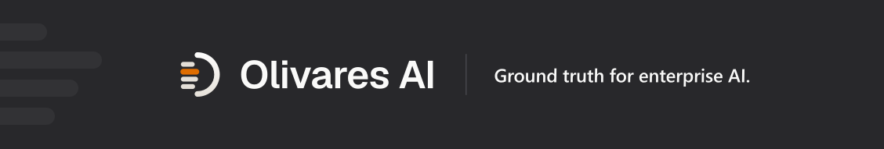</a>

**Idiomas:** [English](./README.md) · **Español** · [简体中文](./README.zh.md) · [Русский](./README.ru.md) · [日本語](./README.ja.md) · [Deutsch](./README.de.md) · [Français](./README.fr.md)

**Integra, gestiona y asegura la IA que ejecutas, desde un único binario autoalojado.**

[Instalación](#install) · [Inicio rápido](#quickstart) · [Ejemplos](examples/) · [Documentación](#documentation) · [Seguridad](#security) · [Contribuir](CONTRIBUTING.md) · [olivares.ai](https://olivares.ai)

[](LICENSING.md)
[](LICENSING.md)
[](CHANGELOG.md)
[](CODE_OF_CONDUCT.md)

</div>

> **Beta**, en desarrollo activo. La primera versión etiquetada, **v26.8.0**, se entrega con archivos firmados, paquetes nativos e imágenes de contenedor. Las API y la superficie de módulos aún pueden cambiar antes de la 1.0; qué funciona hoy, qué está bajo demanda y qué se encuentra en fase de diseño se indica en [Honestidad y límites](docs-site/src/content/docs/start/honesty-and-limits.md) y, para cada módulo, en el [catálogo de módulos](docs-site/src/content/docs/reference/modules/overview.md).

## Qué es

Lo que ejecutas ahora es un estate —agentes de programación, servidores MCP, endpoints de modelos, cuentas de servicio y trabajos programados— repartido por máquinas que nunca formaron un único sistema. Olivares AI es el único binario de Go autoalojado, con la consola incluida, que lo mantiene unido: da a tu IA contexto, acceso a recursos y sesiones gestionadas, y te da a ti los permisos, las políticas, los presupuestos y la evidencia para saber qué se está ejecutando, quién lo puso en marcha, a qué accedió, cuánto costó y quién dio su conformidad.

**Multiproveedor por diseño.** Claude Code se integra al nivel más profundo —el hook `PreToolUse`/`PostToolUse`, los ajustes gestionados, el inicio y la detención desde la consola y el acceso a modelos por sujeto—, con Codex y Grok Build a su lado como superficies de comandos de primera clase, y gemini-cli, Cursor, opencode, goose, cline, OpenHands, OpenClaw y Hermes como conectores propios, cada uno indicando qué puede aplicar y qué solo puede observar. Ollama y otros endpoints autoalojados se incorporan al inventario mediante el conector local, que es de solo lectura por diseño.

**Quién lo ejecuta.** La misma build en todas las escalas: un servidor doméstico (un binario, SQLite, enlazado a loopback); un autónomo con una organización (tenant) por cliente y presupuestos que deniegan antes de que llegue la factura; un equipo de ingeniería con elementos de trabajo compartidos, SSO y un rastro de auditoría que nadie monta a mano; una empresa regulada con seguridad de Postgres a nivel de fila, HA, instalaciones air-gapped y archivado WORM. La build abierta es toda la plataforma y los add-ons comerciales son código aditivo sobre ella, nunca funcionalidades retiradas; SSO, HA, WORM y los presupuestos que realmente deniegan son capacidades que aprovisionas, no valores predeterminados del primer arranque.

No hay telemetría obligatoria ni egreso del plano de control de forma predeterminada: solo cruza tu perímetro lo que tú configuras para que lo cruce —llamadas a tus API de modelos, las salidas SIEM/webhook que conectas, un proveedor de embeddings si aprovisionas uno—. Los collectors leen de los sistemas que ya ejecutas, de modo que un collector que falla nunca se interpone en la ruta de datos de producción.

<div align="center">
<picture>
  <source media="(prefers-color-scheme: dark)" srcset=".github/assets/04-environments-dark.svg">
  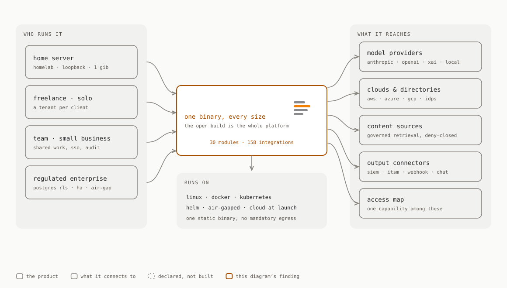
</picture>
<sub>El mismo build abierto de un homelab a una empresa regulada.</sub>
</div>

## Qué hace

<div align="center">
<picture>
  <source media="(prefers-color-scheme: dark)" srcset="docs-site/public/console/access-map-dark.png">
  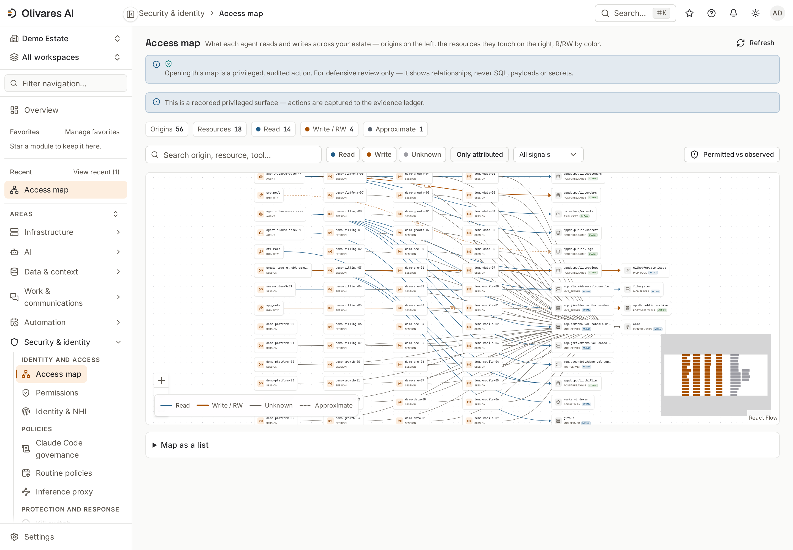
</picture>
<sub><b>Access map</b> — qué lee y escribe cada agente en tu estate; lectura y escritura por color.</sub>
</div>

- **Obsérvalo.** Inventario de cada agente, sesión, modelo, servidor MCP, herramienta e identidad descubiertos; un **access map** de lectura/escritura de aquello a lo que accede realmente cada uno, con una vista de **drift** de Permitido frente a Observado; sesiones en vivo, el grafo de orquestación, salud y SLA. Lo que no puede ver se marca como `unknown`, nunca se adivina.
- **Ejecuta el trabajo.** Elementos de trabajo duraderos con titularidad, dependencias, criterios de aceptación y decisiones; leases vallados, para que dos agentes —o dos personas— no puedan ser titulares del mismo trabajo a la vez; sesiones iniciadas, conectadas y detenidas desde la consola; delegación a pares autorizados mediante A2A. El modo sombra y la autoridad final no están construidos y figuran como ausentes: [El plano de trabajo](docs-site/src/content/docs/explanation/work-plane.md).
- **Gobiérnalo y aplícalo.** Un motor de autorización Cedar y **cuatro puntos de aplicación deny-closed** —el hook de Claude Code, un proxy de inferencia `/v1/messages` en línea, una puerta MCP `tools/call` y una puerta de delegación A2A— para que una acción no autorizada se bloquee, quede retenida a la espera de la aprobación de dos personas o, en el hook, se reescriba antes de ejecutarse; un punto solo cuenta mientras una prueba ejercite su ruta sin configurar y compruebe el rechazo. Presupuestos que deniegan o limitan el gasto, break-glass con control dual y un **kill switch** del estate que falla cerrado.
- **Aliméntalo, con gobierno.** Fuentes de contenido (SharePoint, Confluence, Google Drive, Notion, Salesforce, Snowflake, S3, Azure AI Search, SAP OData, PostgreSQL y una fuente de sistema de ficheros confinada a su raíz) para una recuperación gobernada: recuperación léxica sin egreso lista para usar, recuperación semántica respaldada por modelo cuando aprovisionas un proveedor de embeddings y la habilitación aplicada deny-closed en el momento de la recuperación.
- **Demuéstralo.** Un audit ledger encadenado mediante hashes y firmado con Ed25519; evidencia sellada mapeada a **26 catálogos de marcos** (EU AI Act, NIST AI RMF, ISO 42001, SOC 2, ISO 27001, GDPR…) —familias de controles autoevaluadas, no certificaciones—; envío a SIEM/ITSM (CEF/LEEF/syslog/OTLP/OCSF). Configuración por despliegue: identidad humana y no humana (WebAuthn/FIDO2, PIV/CAC, SSO con un único IdP, reconciliación SCIM, federación de identidades de agentes), guardrails en línea, DLP, cifrado BYOK/CMEK y derecho al olvido con destrucción de claves verificada.

**30 módulos**, una consola, **158 integraciones** — recuentos derivados del código y aplicados en cada push por [`scripts/check-public-counts.sh`](scripts/check-public-counts.sh). Una integración es un directorio de conector con código Go, y doce de ellas son paquetes de biblioteca compartida: [`connectors/README.md`](connectors/README.md) contiene el desglose. Cada módulo con su madurez: el [catálogo de módulos](docs-site/src/content/docs/reference/modules/overview.md); los conectores cableados por nivel de fidelidad: la [referencia de conectores](docs-site/src/content/docs/reference/connectors.md).

<div align="center">
<picture>
  <source media="(prefers-color-scheme: dark)" srcset=".github/assets/03-agent-communication-dark.svg">
  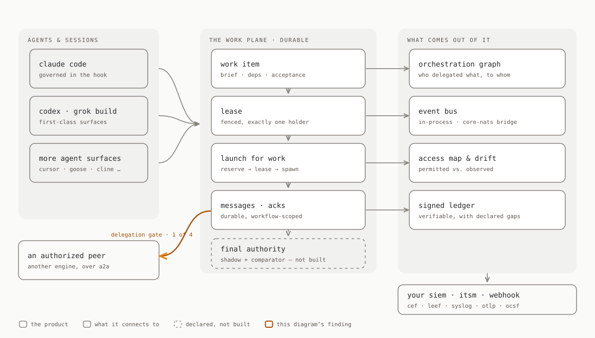
</picture>
<sub>Los agentes comparten un plano de trabajo durable. Lo que no está construido se dibuja ausente.</sub>
</div>

## Un vistazo a la consola

| | |
|---|---|
| <picture><source media="(prefers-color-scheme: dark)" srcset="docs-site/public/console/agentops-dark.png">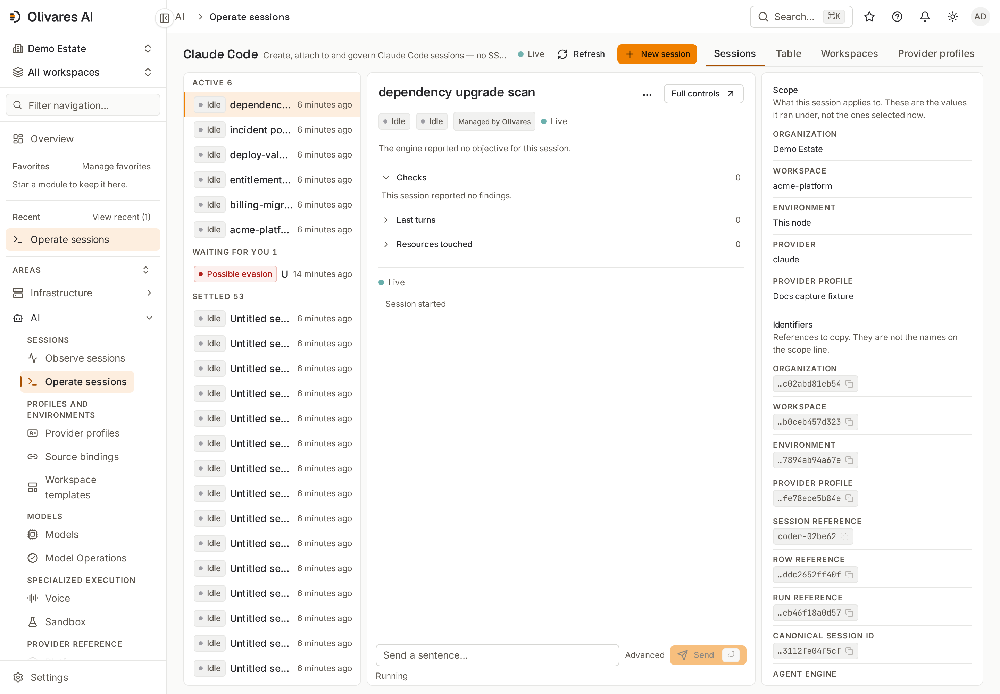</picture><br><sub><b>Claude Code</b> — crea, conéctate y gobierna sesiones desde la consola, sin SSH.</sub> | <picture><source media="(prefers-color-scheme: dark)" srcset="docs-site/public/console/work-dark.png">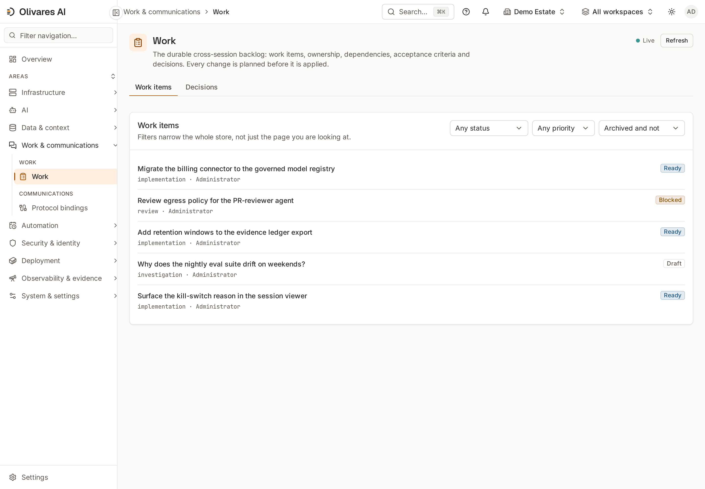</picture><br><sub><b>Trabajo</b> — el backlog duradero entre sesiones: elementos, titularidad, aceptación y decisiones.</sub> |
| <picture><source media="(prefers-color-scheme: dark)" srcset="docs-site/public/console/orchestration-dark.png">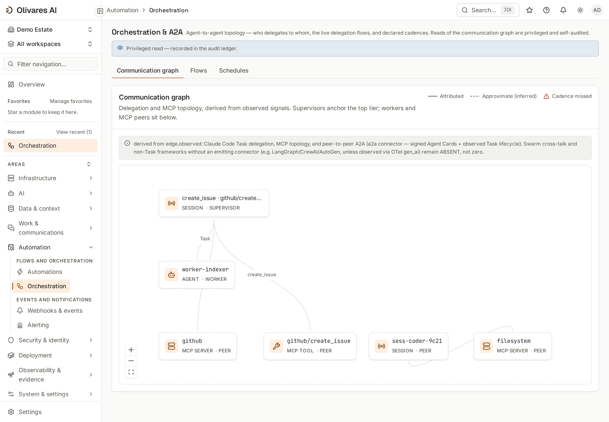</picture><br><sub><b>Orquestación y A2A</b> — quién delega en quién, derivado de señales observadas.</sub> | <picture><source media="(prefers-color-scheme: dark)" srcset="docs-site/public/console/inventory-dark.png">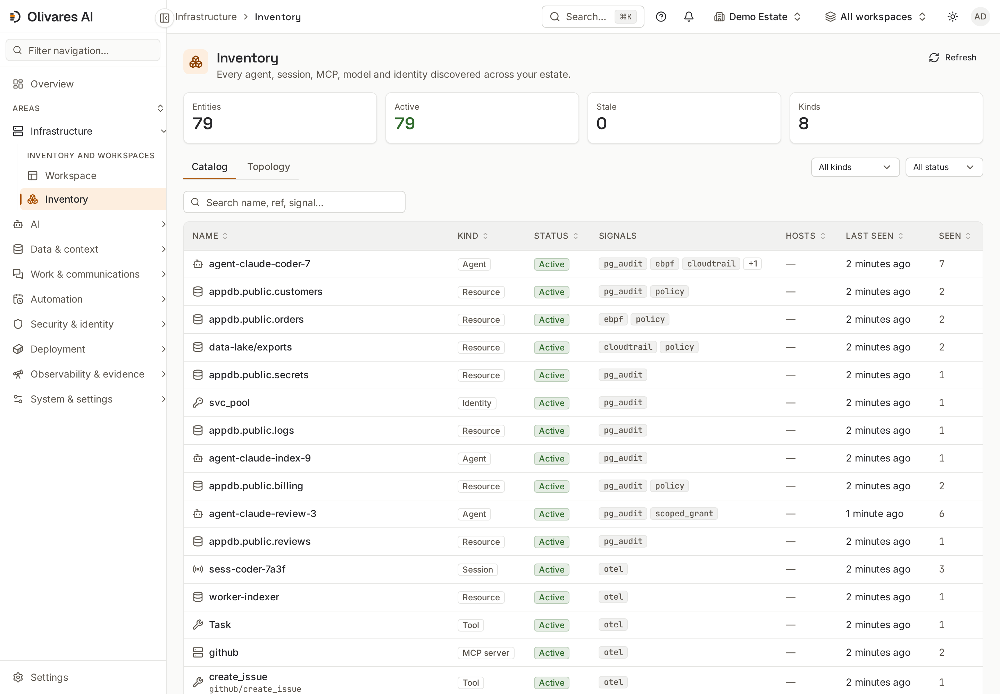</picture><br><sub><b>Inventario</b> — cada agente, sesión, servidor MCP, modelo e identidad descubiertos.</sub> |
| <picture><source media="(prefers-color-scheme: dark)" srcset="docs-site/public/console/access-map-drift-dark.png">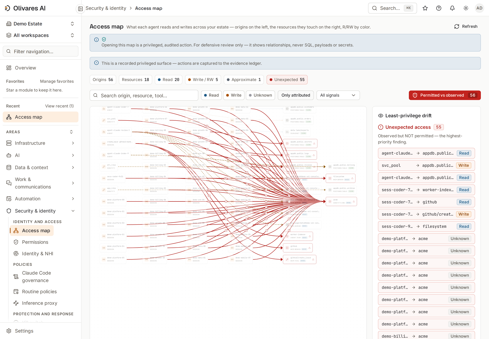</picture><br><sub><b>Drift de mínimo privilegio</b> — observado pero no permitido, y concesiones que nadie usa.</sub> | <picture><source media="(prefers-color-scheme: dark)" srcset="docs-site/public/console/security-dark.png">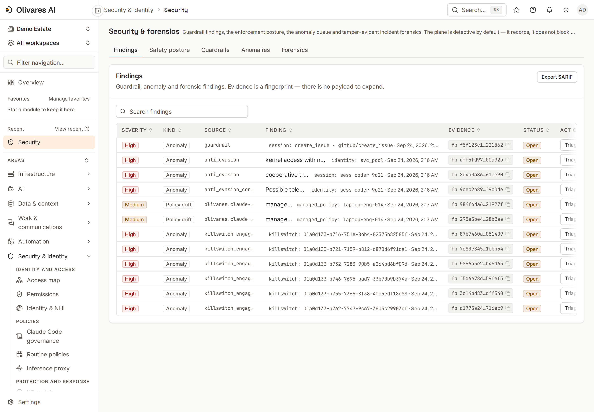</picture><br><sub><b>Seguridad y forense</b> — findings de guardrails, anomalías y análisis forense que permite detectar manipulaciones.</sub> |
| <picture><source media="(prefers-color-scheme: dark)" srcset="docs-site/public/console/killswitch-dark.png">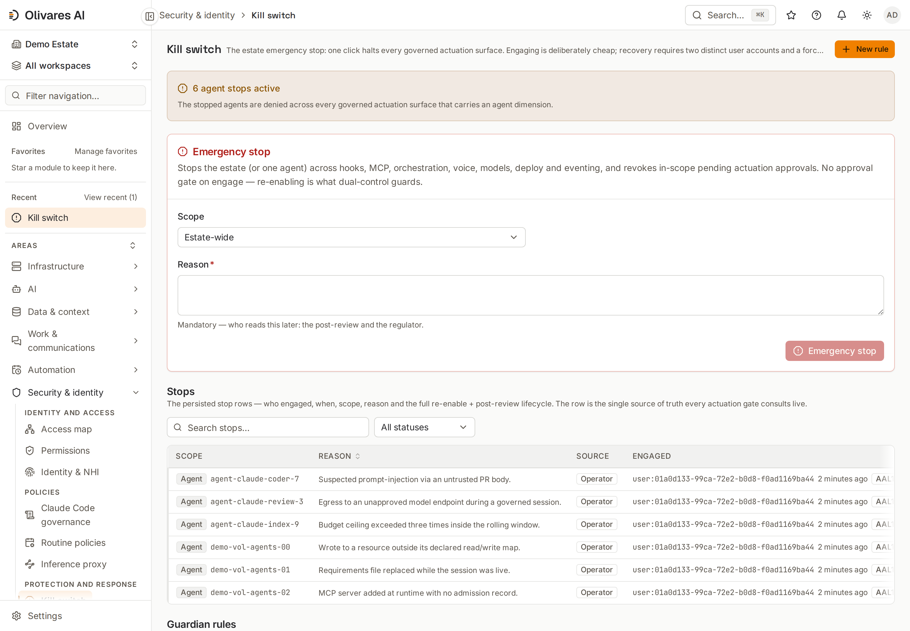</picture><br><sub><b>Kill switch</b> — un clic detiene todas las superficies de actuación gobernadas; la recuperación requiere dos cuentas.</sub> | <picture><source media="(prefers-color-scheme: dark)" srcset="docs-site/public/console/session-viewer-dark.png">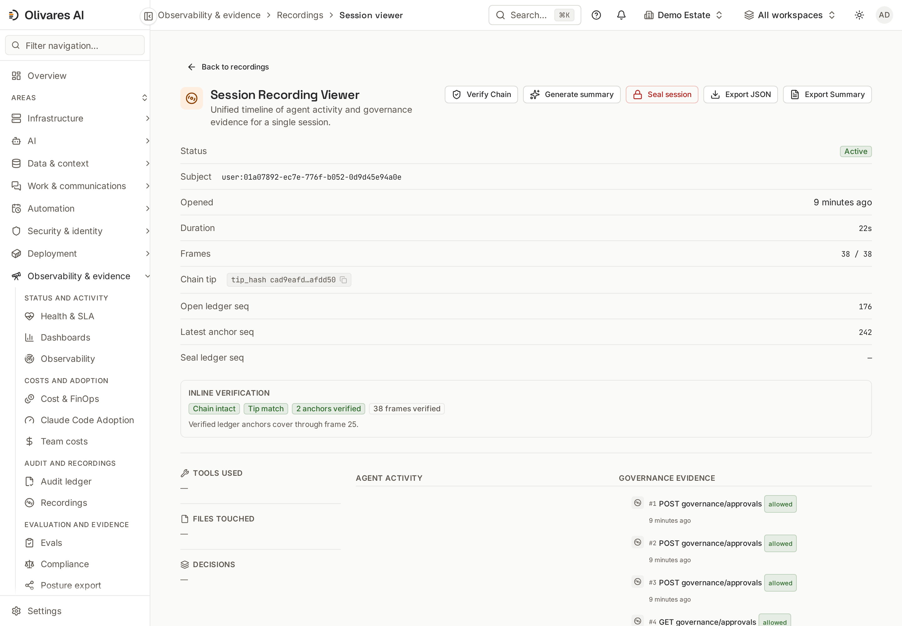</picture><br><sub><b>Grabación de sesión</b> — actividad del agente y evidencia de gobernanza en una única línea de tiempo, con la cadena verificada.</sub> |

Cada imagen fija es una captura del estate de demostración sembrado que sirve el binario en ejecución (`bash scripts/docs-captures.sh` regenera el conjunto en bruto). El mapa completo de pantallas: la [referencia de la consola](docs-site/src/content/docs/reference/console.md).

<a name="install"></a>
## Instalación

Cada versión se publica bajo una cadena de confianza firmada con cosign, verificada según el tipo de artefacto: un manifiesto de checksums firmado con cosign que cubre los archivos comprimidos, los paquetes y los SBOM por archivo comprimido que figuran en él; un SBOM SPDX complementario con una atestación in-toto por cada archivo comprimido; firmas de cosign para la imagen de contenedor, con su propia atestación de SBOM; y declaraciones OpenVEX y procedencia de build SLSA para el conjunto. Para un producto de seguridad, la cadena de suministro forma parte del modelo de confianza: [verifica la versión](docs/RELEASE-VERIFICATION.md) antes de ejecutarla.

**Vía cómoda por HTTPS.** El cuerpo del guion llega por HTTPS y la canalización no lo verifica previamente; una vez en ejecución, detecta tu sistema operativo y arquitectura, exige `cosign`, verifica el manifiesto de checksums firmado y el SHA-256 del archivo comprimido, instala solo el binario y nunca invoca `sudo`. Fija la versión al canalizarlo a una shell:

```sh
curl -fsSL https://raw.githubusercontent.com/olivaresai/olivares/main/scripts/install.sh | sh -s -- --version v26.8.0
olivares quickstart        # TLS on, loopback-only, no default credentials; prints the console URL + a one-time setup token
```

**Vía de alta garantía.** Descarga primero, verifica y después ejecuta: los archivos comprimidos, los paquetes y el manifiesto de checksums están en la [página de la versión](https://github.com/olivaresai/olivares/releases/tag/v26.8.0), y [`scripts/verify-release.sh`](scripts/verify-release.sh) verifica lo que esté presente e indica qué omitió —verificación sin clave de forma predeterminada, `--key … --offline` en un host desconectado—. El [contrato de confianza del instalador](docs/RELEASE-INSTALLER.md) describe ambas vías; el instalador firmado y versionado, con su adaptador de servicio opcional, empieza a distribuirse con la primera versión publicada tras su incorporación, y v26.8.0 es anterior a ese instalador.

| Vía | Qué obtienes |
|---|---|
| **Paquetes Linux** — `.deb`, `.rpm`, `.apk` | el binario, una unidad systemd endurecida, un fichero env de ejemplo y un usuario de servicio `olivares` sin login; el servicio no se arranca por ti |
| **Contenedor** — `docker.io/olivaresai/olivares:26.8.0` | distroless, sin root, etiquetas sin prefijo `v`; `ghcr.io/olivaresai/olivares` es la misma imagen por digest. La imagen predeterminada es multi-arquitectura (amd64/arm64); las variantes `-fips` y `-stig` son solo amd64 |
| **Homebrew** — `brew install olivaresai/tap/olivares` | el binario de la versión en macOS y Linux, verificado con los checksums firmados, con la cuarentena de Gatekeeper eliminada; las builds para darwin aún no están notarizadas por Apple |
| **Kubernetes** — [`deploy/helm/olivares`](deploy/helm/olivares) o [`deploy/manifests/install.yaml`](deploy/manifests/install.yaml) | el código fuente del chart de Helm y un manifiesto plano sin Helm en el árbol; el chart **aún no está publicado en un registro OCI** |
| **Desde el código fuente** — `task build` (Go 1.26+, [Task](https://taskfile.dev), pnpm) | `./bin/olivares quickstart`, el mismo primer arranque seguro por defecto |

El motor es **seguro por defecto**: se enlaza a loopback, sirve HTTPS con un certificado autofirmado en el primer arranque, no incluye credenciales predeterminadas e imprime un token de configuración de un solo uso; en un contenedor o un pod, el proceso escucha en su propia red y el mapeo del host o el Service lo mantiene privado. **Windows** aún no se construye: ejecuta el contenedor Linux o WSL2 ([plan](INSTALL.md#windows)). La matriz por sistema operativo y la configuración de producción: [`INSTALL.md`](INSTALL.md); las guías de despliegue (Compose, Kubernetes, air-gapped) y las [actualizaciones](docs-site/src/content/docs/how-to/upgrade-and-rollback.md): [`docs-site/`](docs-site/).

<a name="quickstart"></a>
## Inicio rápido

Explora un estate sintético o inícialo de verdad. Ambos ejecutan el mismo binario.

```sh
# a deterministic demo estate — loopback-only, no real data
olivares serve --seed-demo --insecure --listen 127.0.0.1:8901 --grpc-listen 127.0.0.1:8902 --data-dir "$(mktemp -d)"
# open http://127.0.0.1:8901 — inventory, work, orchestration, access map + drift, policies, FinOps

# the real thing — TLS on, loopback; create the first administrator with the printed token
olivares quickstart
```

La semilla de demostración es solo para aprender (contraseña pública en el árbol de fuentes): nunca la apuntes a datos reales. La CI recorre la misma ruta con `task smoke:quickstart` y comprueba los recuentos del access map y el drift (20 nodos / 13 aristas, con 8 accesos inesperados y 2 concesiones sin uso), de modo que esta página no puede alejarse del código sin hacer ruido. El [inicio rápido completo](docs-site/src/content/docs/start/quickstart.md) conecta un conector pgAudit real y enlaza las vías de instalación para producción.

## Ediciones

<div align="center">
<picture>
  <source media="(prefers-color-scheme: dark)" srcset=".github/assets/05-editions-dark.svg">
  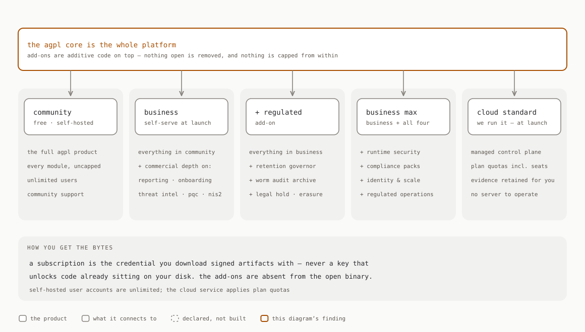
</picture>
<sub>Ediciones por composición. Empaquetado y precios a petición.</sub>
</div>

La build AGPL es toda la plataforma y nunca se limita por funcionalidades desde dentro; los add-ons comerciales son código aditivo, nunca funcionalidades retiradas del producto abierto. Una suscripción es la credencial para descargar packs de módulos firmados —un modelo de distribución, no una clave que desbloquea código que ya está en tu disco—. Las cuentas de usuario son ilimitadas en el motor autoalojado y los **cuatro puntos de aplicación deny-closed** se incluyen en abierto. La matriz área por área de capacidades abiertas, comerciales y previstas: [`LICENSING.md`](LICENSING.md) y [Open core y licencias](docs-site/src/content/docs/explanation/open-core-and-licensing.md).

## Arquitectura

<div align="center">
<picture>
  <source media="(prefers-color-scheme: dark)" srcset=".github/assets/02-architecture-dark.svg">
  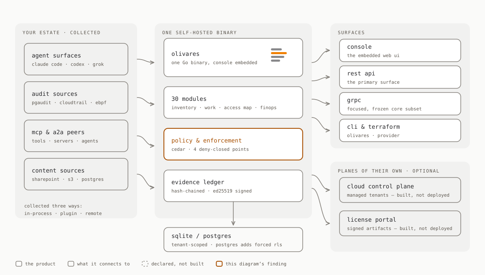
</picture>
</div>

Un único binario estático de Go embebe la consola y expone cuatro superficies con cobertura documentada: la API REST (principal), un espejo gRPC acotado del núcleo estable, la CLI `olivares` y un proveedor de Terraform. Los collectors se ejecutan dentro de tu infraestructura en tres modos; el almacén es SQLite o Postgres con seguridad a nivel de fila, aplicada una vez en la API del almacén y de nuevo por Postgres. Los detalles, incluido el plano de trabajo pieza por pieza: [`ARCHITECTURE.md`](ARCHITECTURE.md).

<a name="documentation"></a>
## Documentación

[docs.olivares.ai](https://docs.olivares.ai) — tutoriales de instalación probados (nodo único, Docker Compose, Kubernetes/Helm, air-gapped), guías de conectores con capturas reales de la consola, un recetario (políticas deny-closed, presupuestos, aprobaciones, ejercicios de kill switch, envío a SIEM), referencia de API y un glosario. Empieza por [Qué es Olivares AI](docs-site/src/content/docs/start/what-is-olivares-ai.md) y [Honestidad y límites](docs-site/src/content/docs/start/honesty-and-limits.md).

<a name="security"></a>
## Seguridad

Comunica una vulnerabilidad de forma privada mediante [`SECURITY.md`](SECURITY.md), nunca como una issue pública. El motor es de lectura primero y opera con datos mínimos: el access map almacena aristas, no payloads, y abrirlo es una acción registrada. Flujo de avisos: [`docs/security-advisories.md`](docs/security-advisories.md); mapa de evidencias de la cadena de suministro: [`docs/openssf-badge.md`](docs/openssf-badge.md).

## Comunidad

[`CONTRIBUTING.md`](CONTRIBUTING.md) (configuración, DCO/CLA, SPDX, la frontera de conectores) · [`CODE_OF_CONDUCT.md`](CODE_OF_CONDUCT.md) (Contributor Covenant 2.1) · [`SUPPORT.md`](SUPPORT.md) · [`GOVERNANCE.md`](GOVERNANCE.md) · [`CHANGELOG.md`](CHANGELOG.md) (Keep a Changelog 1.1, CalVer `vYY.M.PATCH`).

## Licencia

`core/`, `modules/` y `web/` son **AGPL-3.0-only**; `sdk/`, `connectors/` y `clients/` son **Apache-2.0**, y un conector nunca importa el motor. Los add-ons comerciales son independientes, opcionales y de código cerrado: se construyen solo con `-tags enterprise` y nunca están en este repositorio ni en el binario abierto; para licencias comerciales, contacta con `enterprise@olivares.ai` — [`LICENSING.md`](LICENSING.md). Las contribuciones requieren un sign-off DCO (`git commit -s`) y el [CLA](CLA.md).

> **Sin garantía, sin responsabilidad.** El software se proporciona **tal cual**, **sin garantía de ningún tipo** y **sin responsabilidad por pérdida de datos, interrupción del negocio o lucro cesante**. En un plano de control no es una formalidad: una mala configuración puede bloquear trabajo legítimo o dejar pasar exactamente lo que pretendías detener. Se aplican AGPL-3.0-only §§15–16, Apache-2.0 §§7–8 y el término suplementario de este proyecto — [`DISCLAIMER.md`](DISCLAIMER.md).

## Apoya el proyecto

El núcleo es libre y seguirá siéndolo; mantener cada versión firmada, verificada y al día es un trabajo sostenido. Si Olivares AI te resulta útil, puedes patrocinarlo mediante GitHub Sponsors — [github.com/sponsors/olivaresai](https://github.com/sponsors/olivaresai) o [github.com/sponsors/fran-olivares](https://github.com/sponsors/fran-olivares) — o con una aportación puntual en Ko-fi. El patrocinio **no** es un contrato de soporte ni compra prioridad ([`SUPPORT.md`](SUPPORT.md)); quienes pidan figurar aparecen en [`SUPPORTERS.md`](SUPPORTERS.md).

[](https://ko-fi.com/Z1R625SAD2)

---

<div align="center">

<picture>
  <source media="(prefers-color-scheme: dark)" srcset=".github/assets/olivares-mark-dark.svg">
  
</picture>

<sub><strong>Ground truth para la IA empresarial.</strong> · <a href="https://olivares.ai">olivares.ai</a> · <a href="LICENSING.md">AGPL-3.0 + commercial</a></sub>

</div>
