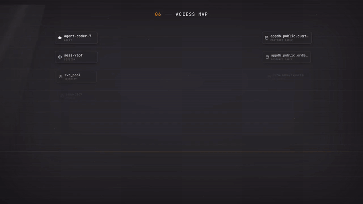
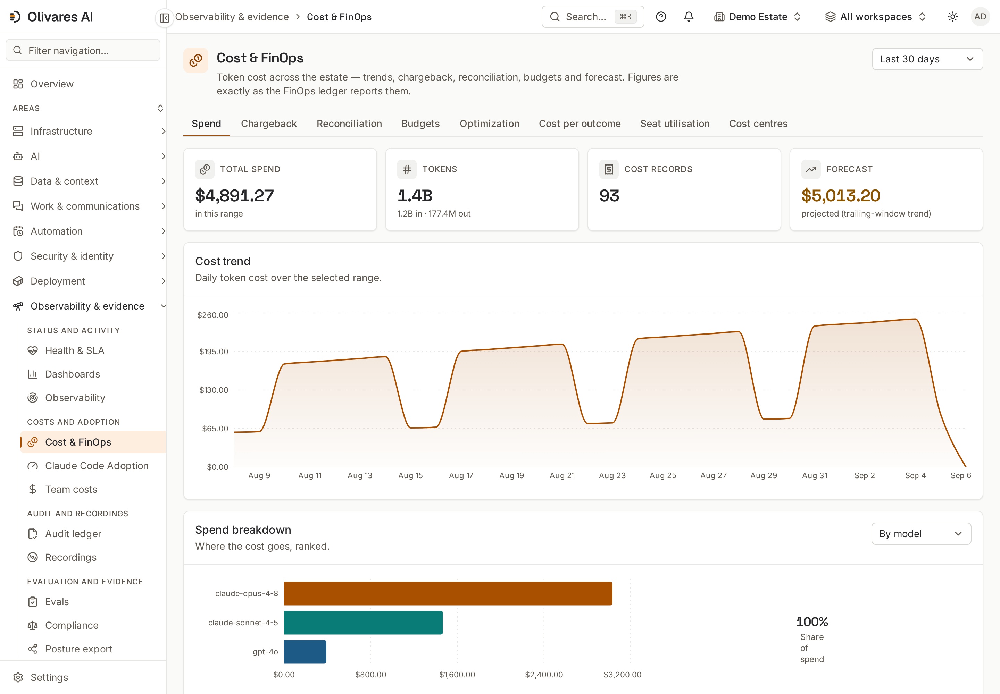

<div align="center">

<a href="https://olivares.ai"></a>

**Langues :** [English](./README.md) · [Español](./README.es.md) · [简体中文](./README.zh.md) · [Русский](./README.ru.md) · [日本語](./README.ja.md) · [Deutsch](./README.de.md) · **Français**

**Exécutez et gouvernez l'IA que vous utilisez déjà — sur votre propre infrastructure, avec une seule ground truth.**

[Ce que c'est](#ce-que-cest) · [Ce qu'il fait](#ce-quil-fait) · [Installation](#installation) · [Démarrage rapide](#démarrage-rapide) · [Console](#un-aperçu-de-la-console) · [Éditions](#éditions-et-tarifs) · [Documentation](#documentation) · [Sécurité](#sécurité) · [olivares.ai](https://olivares.ai)

[](LICENSING.md)
[](LICENSING.md)
[](https://github.com/olivaresai/olivares/releases/tag/v26.9.0)
[](CHANGELOG.md)
[](CODE_OF_CONDUCT.md)

</div>

> **Bêta**, en développement actif. **v26.9.0** est livrée avec des archives signées, des paquets natifs et des images de conteneur. Ce qui fonctionne aujourd'hui, ce qui est à la demande et ce qui est au stade de la conception sont indiqués dans [Honnêteté et limites](docs-site/src/content/docs/start/honesty-and-limits.md).

## Ce que c'est

Votre estate d'IA aujourd'hui, ce sont des agents de programmation, des serveurs MCP, des endpoints de modèles, des comptes de service et des tâches planifiées, répartis sur des machines qui n'ont jamais formé un seul système. Personne ne peut dire, depuis un seul endroit, ce qui s'exécute, qui l'a lancé, ce qu'il a atteint, ce que cela a coûté et qui y a consenti.

Olivares AI est **un unique binaire Go auto-hébergé, console comprise**, qui tient cet estate ensemble : il donne à l'IA ce dont elle a besoin pour travailler (contexte, accès aux ressources, sessions gérées) et vous donne les permissions, les politiques, les budgets et les preuves pour l'exploiter. Auto-hébergé, sans télémétrie obligatoire, installations air-gapped prises en charge.

Claude Code est intégré au niveau le plus profond (le hook `PreToolUse`/`PostToolUse`, les réglages gérés, le lancement et l'arrêt depuis la console) ; les CLI officielles de Codex et de Grok sont des pilotes de session de première classe ; gemini-cli, Cursor, opencode, goose, cline, OpenHands, OpenClaw, Hermes et les endpoints auto-hébergés tels qu'Ollama sont des connecteurs, chacun indiquant ce qu'il peut appliquer et ce qu'il peut seulement observer. La build AGPL est le produit entier, jamais plafonnée en fonctionnalités depuis l'intérieur ; aucun plan ne compte les utilisateurs.

## Ce qu'il fait

<div align="center">

<br><sub><b>La carte d'accès</b> — ce que chaque agent lit et écrit dans votre estate, le permis face à l'observé.</sub>
</div>

- **Voyez-le.** Inventaire de chaque agent, session, modèle, serveur MCP, outil et identité découverts ; une **carte d'accès** en lecture/écriture avec une vue de **drift** Permis-contre-Observé ; sessions en direct, le graphe d'orchestration, la santé et le SLA. Ce qu'il ne peut pas voir est marqué `unknown`, jamais deviné.
- **Exécutez le travail.** Éléments de travail durables avec titulaire, dépendances, critères d'acceptation et décisions ; baux clôturés, pour que deux agents ne puissent pas détenir le même travail en même temps ; sessions de Claude Code, Codex et Grok lancées, auxquelles on s'attache, interrompues et arrêtées depuis la console ; délégation à des pairs autorisés via A2A.
- **Gouvernez et appliquez.** Un moteur d'autorisation Cedar et **quatre points d'application fermés par défaut (deny-closed)** — le hook Claude Code, un proxy d'inférence `/v1/messages` en ligne, une porte MCP `tools/call` et une porte de délégation A2A — pour qu'une action non autorisée soit bloquée, retenue pour une approbation à deux personnes ou réécrite avant de s'exécuter. Des budgets qui refusent ou limitent les dépenses, le break-glass à double contrôle, et un **kill-switch** de l'estate qui échoue fermé.
- **Nourrissez-le, sous gouvernance.** Sources de contenu (SharePoint, Confluence, Google Drive, Notion, Salesforce, Snowflake, S3, Azure AI Search, SAP OData, PostgreSQL, un système de fichiers confiné à sa racine) vers une récupération gouvernée, habilitation appliquée deny-closed au moment de la récupération.
- **Prouvez-le.** Un audit ledger en chaîne de hachage, signé Ed25519 ; des preuves scellées mappées à **26 catalogues de cadres** (EU AI Act, NIST AI RMF, ISO 42001, SOC 2, ISO 27001, GDPR…) — familles de contrôles autoévaluées, pas des certifications ; push SIEM/ITSM (CEF/LEEF/syslog/OTLP/OCSF) ; WebAuthn/FIDO2, PIV/CAC, SSO, SCIM, BYOK/CMEK et droit à l'effacement vérifié, configurés par déploiement.

**30 modules**, une console, **158 intégrations** — des décomptes dérivés du code et appliqués à chaque push par [`scripts/check-public-counts.sh`](scripts/check-public-counts.sh) ; le détail est dans [`connectors/README.md`](connectors/README.md), chaque module avec sa maturité dans le [catalogue des modules](docs-site/src/content/docs/reference/modules/overview.md).

## Installation

Choisissez une méthode : une commande installe, puis `olivares quickstart` affiche l'URL de la console et le jeton de configuration à usage unique. Chaque version est signée avec cosign, avec provenance SLSA et SBOM ; chaque voie ci-dessous vérifie avant d'installer, et `scripts/verify-release.sh` contrôle un téléchargement manuel (cosign + SHA-256, [comment](INSTALL.md#verifying-a-release)). Le moteur est **sécurisé par défaut** : liaison loopback, HTTPS au premier démarrage, aucun identifiant par défaut, un jeton de configuration à usage unique imprimé au premier démarrage.

**1 · Une commande, Linux et macOS** — l'installeur vérifié : détecte le système d'exploitation et l'architecture, vérifie les sommes de contrôle signées et le SHA-256 de l'archive, installe uniquement le binaire, n'exécute jamais `sudo`.

```sh
curl -fsSL https://olivares.ai/olivares/install.sh | sh
olivares quickstart        # prints the console URL and the one-time setup token
```

Ajoutez `--user` pour un service utilisateur (unité systemd utilisateur ou LaunchAgent), ou exécutez le script vérifié depuis un shell privilégié avec `--system --start` pour un service système. Vous préférez télécharger, vérifier et exécuter à la main ? Le chemin binaire manuel et la matrice par OS : [`INSTALL.md`](INSTALL.md).

**2 · Docker** — multi-arch, distroless, non-root ; le mapping de l'hôte le maintient en loopback uniquement.

```sh
docker run -d --name olivares -p 127.0.0.1:8443:8443 -p 127.0.0.1:8444:8444 \
  -v olivares-data:/var/lib/olivares \
  docker.io/olivaresai/olivares \
  serve --listen :8443 --grpc-listen :8444 --data-dir /var/lib/olivares
```

`ghcr.io/olivaresai/olivares` est la même image par digest ; en production, épinglez par digest. Variantes d'image FIPS et STIG : [`INSTALL.md`](INSTALL.md#docker).

**3 · Docker Compose** — une pile durcie, SQLite mononœud avec Postgres et sauvegarde optionnels.

```sh
git clone --depth 1 https://github.com/olivaresai/olivares.git && cd olivares
docker compose -f deploy/compose/docker-compose.yml up --wait --wait-timeout 120
```

**4 · Kubernetes** — le chart Helm de l'arbre, ou un manifeste plat sans Helm ; le chart n'est pas encore publié dans un registre OCI.

```sh
helm install olivares deploy/helm/olivares -n olivares-system --create-namespace
# or, Helm-free
kubectl create namespace olivares-system && kubectl apply -n olivares-system -f deploy/manifests/install.yaml
```

**5 · Paquets Linux** — `.deb`, `.rpm`, `.apk` depuis la [page de la version](https://github.com/olivaresai/olivares/releases/tag/v26.9.0) : le binaire, un fichier env d'exemple, un utilisateur `olivares` sans login et une unité durcie ; le service n'est pas démarré pour vous.

```sh
sudo dpkg -i olivares_*_linux_amd64.deb        # Debian / Ubuntu   (sudo rpm -i … on RHEL / Fedora / SUSE; sudo apk add --allow-untrusted … on Alpine)
sudo systemctl enable --now olivares           # OpenRC hosts: sudo rc-service olivares start
```

**6 · Homebrew** — macOS et Linux, contrôlé contre les sommes de contrôle signées.

```sh
brew install olivaresai/tap/olivares && olivares quickstart
```

**7 · Depuis les sources** — Go 1.26+, [Task](https://taskfile.dev), pnpm.

```sh
task build && ./bin/olivares quickstart
```

**Air-gapped** : empaquetez l'image signée, le chart et le matériel de vérification et vérifiez hors ligne avec `scripts/verify-release.sh --key … --offline` ([guide](docs-site/src/content/docs/how-to/air-gap-install.md)). **Windows** n'est pas encore construit : exécutez le conteneur Linux ou WSL2 ([plan](INSTALL.md#windows)). Mises à niveau et rollback : [guide](docs-site/src/content/docs/how-to/upgrade-and-rollback.md).

## Démarrage rapide

```sh
# a deterministic demo estate — loopback-only, no real data
olivares serve --seed-demo --insecure --listen 127.0.0.1:8901 --grpc-listen 127.0.0.1:8902 --data-dir "$(mktemp -d)"
# open http://127.0.0.1:8901 — inventory, work, orchestration, access map + drift, policies, FinOps

# the real thing — TLS on, loopback; create the first administrator with the printed token
olivares quickstart
```

La graine de démonstration est uniquement pour apprendre (mot de passe public dans l'arbre source) : ne la pointez jamais vers des données réelles. La CI parcourt le même chemin avec `task smoke:quickstart` et vérifie les décomptes de la carte d'accès et du drift (20 nœuds / 13 arêtes, avec 8 accès inattendus et 2 octrois inutilisés). Le [démarrage rapide complet](docs-site/src/content/docs/start/quickstart.md) raccorde un vrai connecteur pgAudit.

## Un aperçu de la console

| | |
|---|---|
| <picture><source media="(prefers-color-scheme: dark)" srcset="docs-site/public/console/access-map-dark.png"></picture><br><sub><b>Carte d'accès</b> — origines à gauche, ressources à droite, lecture et écriture par couleur.</sub> | <picture><source media="(prefers-color-scheme: dark)" srcset="docs-site/public/console/access-map-drift-dark.png"></picture><br><sub><b>Drift de moindre privilège</b> — observé mais non permis, et octrois que personne n'utilise.</sub> |
| <picture><source media="(prefers-color-scheme: dark)" srcset="docs-site/public/console/agentops-dark.png"></picture><br><sub><b>Sessions</b> — créez, attachez-vous et gouvernez des sessions depuis la console, sans SSH.</sub> | <picture><source media="(prefers-color-scheme: dark)" srcset="docs-site/public/console/work-dark.png"></picture><br><sub><b>Travail</b> — le backlog durable inter-sessions : éléments, titulaire, acceptation, décisions.</sub> |
| <picture><source media="(prefers-color-scheme: dark)" srcset="docs-site/public/console/security-dark.png"></picture><br><sub><b>Sécurité &amp; forensique</b> — constats de guardrails, anomalies, forensique inviolable.</sub> | <picture><source media="(prefers-color-scheme: dark)" srcset="docs-site/public/console/finops-dark.png"></picture><br><sub><b>FinOps</b> — dépenses par modèle et agent, budgets qui refusent ou limitent, run-rate.</sub> |

Chaque image fixe est une capture de l'estate de démonstration ensemencé servi par le binaire en cours d'exécution. La carte complète des écrans : la [référence de la console](docs-site/src/content/docs/reference/console.md).

## Éditions et tarifs

La build AGPL est toute la plateforme, jamais plafonnée en fonctionnalités depuis l'intérieur. Les add-ons commerciaux sont du code additif par-dessus, jamais des fonctionnalités retirées ; un abonnement est l'identifiant d'accès pour télécharger des packs de modules signés. Les comptes utilisateurs sont illimités dans le moteur auto-hébergé, et les **quatre points d'application deny-closed** sont ouverts.

| Édition | Pour qui | Ce qu'elle ajoute |
|---|---|---|
| **Community** | N'importe qui. Gratuit, AGPL-3.0, utilisateurs illimités. | Le produit complet, auto-hébergé. Aucune porte de licence sur le cœur. |
| **Business** | Une organisation qui l'adopte. Tarif par déploiement, jamais par siège. | Des services et des packs optionnels, pas des fonctions du cœur : la licence commerciale, un canal de versions signées maintenu, le support par e-mail aux heures ouvrables, et quatre add-ons optionnels : **Regulated Operations**, **Compliance Packs**, **AI Runtime Security** et **Identity & Scale** (qui inclut le cockpit de sessions des outils officiels). Les quatre ensemble, c'est **Business Max**. |
| **Cloud** | Les équipes qui veulent le même plan exploité pour elles, prépayé, sur une infrastructure partagée. | Un plan de contrôle géré avec des plafonds publiés. Pas d'essai Cloud ; l'option gratuite reste Community auto-hébergé. |
| **Enterprise** | Estates réglementés, multi-entités, à grande échelle. | Un contrat, convenu par e-mail et signé sur un bon de commande annuel. |

Tarifs, la matrice des add-ons et les conditions d'achat : [olivares.ai/pricing](https://olivares.ai/pricing). La matrice ouvert/commercial/prévu : [`LICENSING.md`](LICENSING.md).

## Architecture

Un unique binaire Go statique embarque la console et expose quatre surfaces : l'API REST (principale), un miroir gRPC ciblé du cœur stable, la CLI `olivares` et un provider Terraform. Les collecteurs s'exécutent au sein de votre infrastructure ; le store est SQLite ou Postgres avec sécurité au niveau ligne, appliquée une première fois dans l'API du store puis de nouveau par Postgres. Le tableau complet, plan de travail inclus : [`ARCHITECTURE.md`](ARCHITECTURE.md).

## Documentation

[docs.olivares.ai](https://docs.olivares.ai) — tutoriels d'installation testés (mononœud, Docker Compose, Kubernetes/Helm, air-gapped), guides de connecteurs avec de vraies captures de console, un cookbook (politiques deny-closed, budgets, approbations, exercices de kill-switch, push SIEM), référence API et un glossaire. Commencez par [Qu'est-ce qu'Olivares AI](docs-site/src/content/docs/start/what-is-olivares-ai.md). Sur le site : [produit](https://olivares.ai/product) · [solutions](https://olivares.ai/solutions) · [comment ça marche](https://olivares.ai/how-it-works) · [architecture](https://olivares.ai/architecture) · [sécurité](https://olivares.ai/security) · [confiance](https://olivares.ai/trust) · [comparer](https://olivares.ai/compare) · [démo](https://olivares.ai/demo) · [changelog](https://olivares.ai/changelog) · [statut](https://olivares.ai/status) · [feuille de route](https://olivares.ai/roadmap) · [marque](https://olivares.ai/brand) · [presse](https://olivares.ai/press). Versions : [GitHub](https://github.com/olivaresai/olivares/releases) · [`CHANGELOG.md`](CHANGELOG.md).

## Sécurité

Signalez une vulnérabilité en privé via [`SECURITY.md`](SECURITY.md), jamais dans une issue publique. Le moteur est lecture-d'abord et données-minimales : la carte d'accès stocke des arêtes, pas des payloads, et l'ouvrir est une action enregistrée. Vérifier une licence ne nous appelle jamais ; le cœur AGPL n'effectue aucun appel de licence. Flux des avis : [`docs/security-advisories.md`](docs/security-advisories.md) ; preuves de la chaîne d'approvisionnement : [`docs/openssf-badge.md`](docs/openssf-badge.md).

## Communauté

[`CONTRIBUTING.md`](CONTRIBUTING.md) (configuration, DCO/CLA, SPDX, la frontière des connecteurs) · [`CODE_OF_CONDUCT.md`](CODE_OF_CONDUCT.md) · [`SUPPORT.md`](SUPPORT.md) · [`GOVERNANCE.md`](GOVERNANCE.md) · [`CHANGELOG.md`](CHANGELOG.md) (Keep a Changelog, CalVer `vYY.M.PATCH`).

## Licence

`core/`, `modules/` et `web/` sont **AGPL-3.0-only** ; `sdk/`, `connectors/` et `clients/` sont **Apache-2.0**, et un connecteur n'importe jamais le moteur. Les add-ons commerciaux sont séparés, optionnels et fermés — compilés uniquement avec `-tags enterprise`, jamais dans ce dépôt ; licences commerciales : `enterprise@olivares.ai` — [`LICENSING.md`](LICENSING.md). Les contributions nécessitent une signature DCO (`git commit -s`) et la [CLA](CLA.md).

> **Aucune garantie, aucune responsabilité.** Le logiciel est fourni **en l'état**, **sans garantie d'aucune sorte** et **sans responsabilité en cas de perte de données, d'interruption d'activité ou de perte de profits**. Sur un plan de contrôle, ce n'est pas une formalité : une mauvaise configuration peut bloquer un travail légitime ou laisser passer exactement ce que vous vouliez arrêter. L'AGPL-3.0-only §§15–16, l'Apache-2.0 §§7–8 et le terme supplémentaire propre à ce projet s'appliquent — [`DISCLAIMER.md`](DISCLAIMER.md).

## Soutenir le projet

Le cœur est libre et le restera ; maintenir chaque version signée, vérifiée et à jour est un travail continu. Parrainez-le via GitHub Sponsors — [github.com/sponsors/olivaresai](https://github.com/sponsors/olivaresai) ou [github.com/sponsors/fran-olivares](https://github.com/sponsors/fran-olivares) — ou par un don ponctuel sur Ko-fi. Le parrainage n'est pas un contrat de support ([`SUPPORT.md`](SUPPORT.md)) ; les parrains qui demandent à être nommés figurent dans [`SUPPORTERS.md`](SUPPORTERS.md).

[](https://ko-fi.com/Z1R625SAD2)

---

<div align="center">

<picture>
  <source media="(prefers-color-scheme: dark)" srcset=".github/assets/olivares-mark-dark.svg">
  
</picture>

<sub><strong>La ground truth de l'IA d'entreprise.</strong> · <a href="https://olivares.ai">olivares.ai</a> · <a href="LICENSING.md">AGPL-3.0 + commercial</a></sub>

</div>
