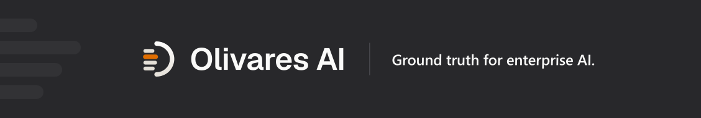
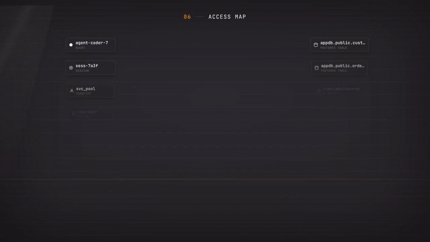
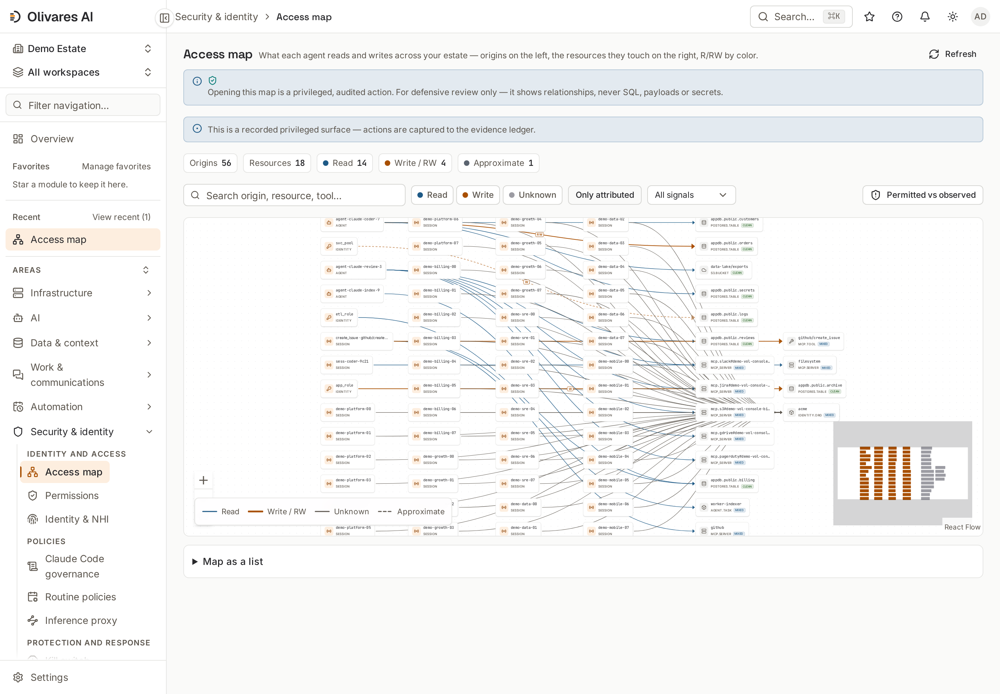
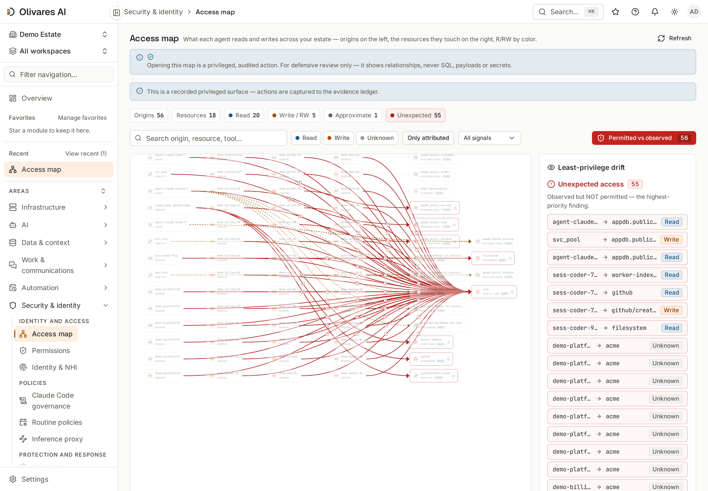
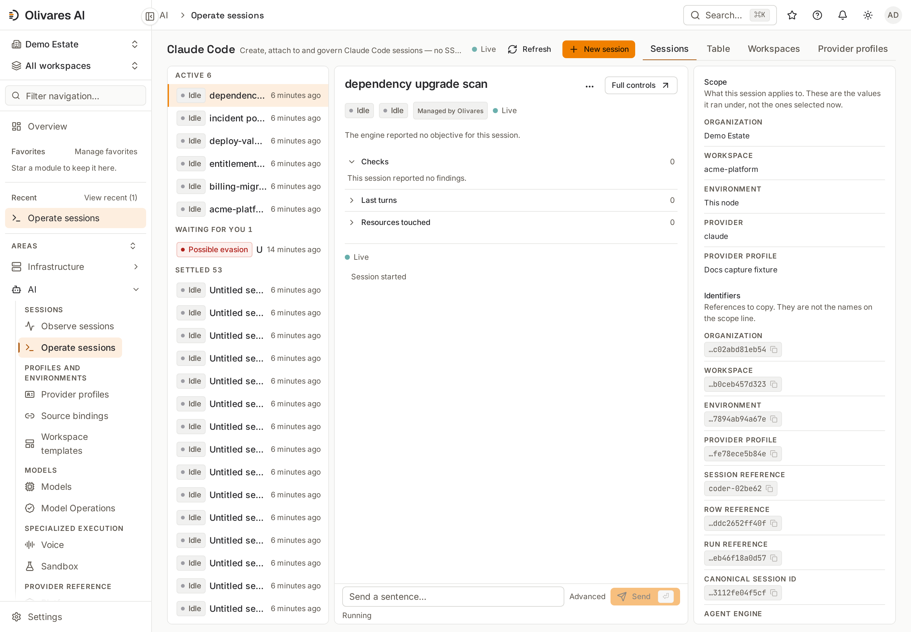
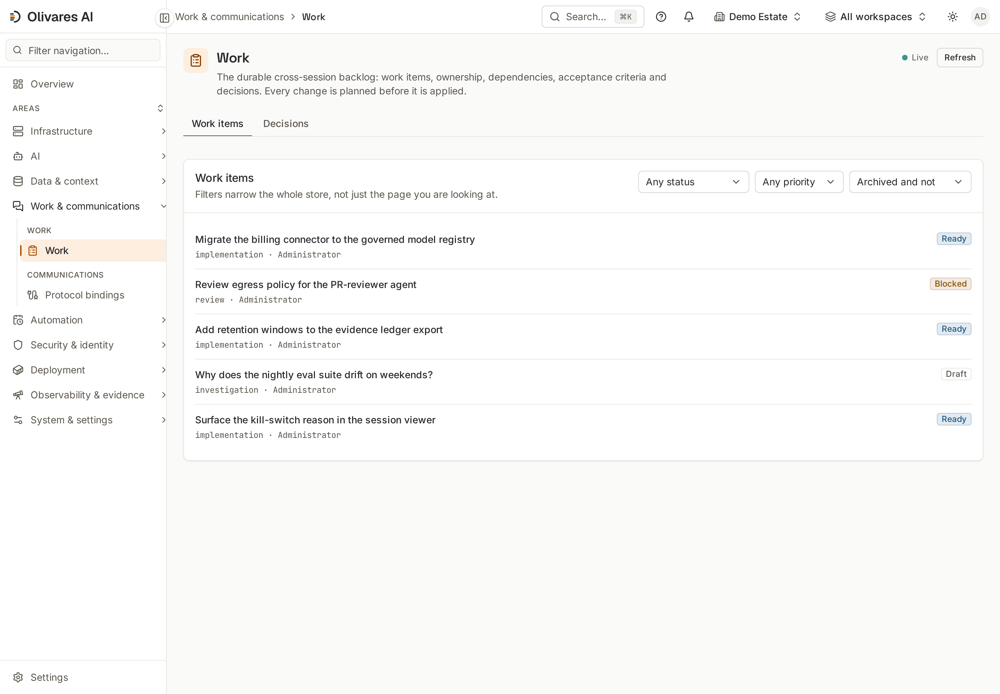
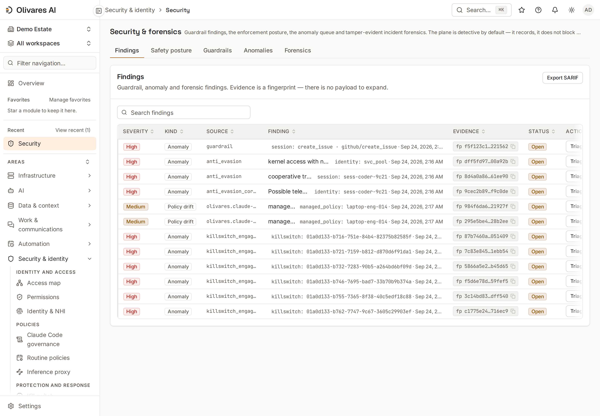
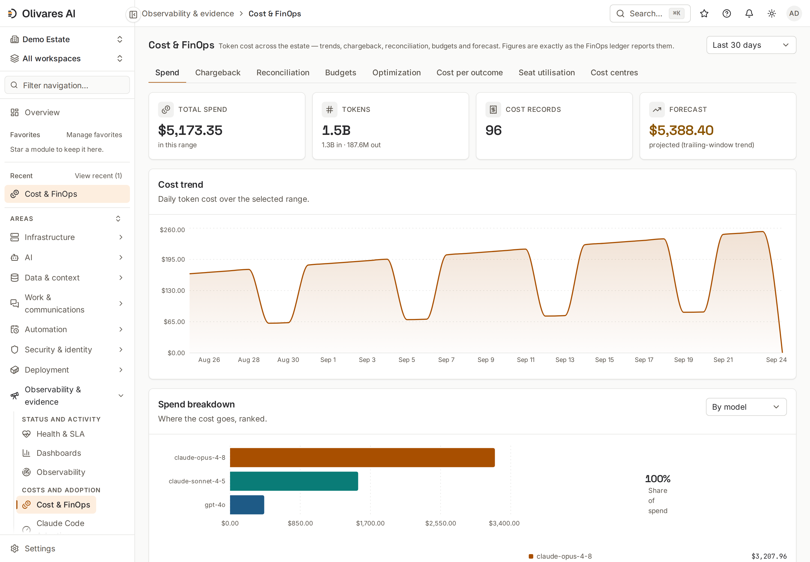

<div align="center">

<a href="https://olivares.ai"></a>

**Языки:** [English](./README.md) · [Español](./README.es.md) · [简体中文](./README.zh.md) · **Русский** · [日本語](./README.ja.md) · [Deutsch](./README.de.md) · [Français](./README.fr.md)

**Запускайте AI, которым уже пользуется ваша команда, с тем же контролем, что и над остальной инфраструктурой.**

[Что оно делает](#что-оно-делает) · [Установка](#установка) · [Консоль](#взгляд-внутрь-консоли) · [Редакции](#редакции-и-цены) · [Документация](#документация) · [Сообщество](#сообщество) · [olivares.ai](https://olivares.ai)

[](LICENSING.md)
[](LICENSING.md)
[](https://github.com/olivaresai/olivares/releases/tag/26.10.1)
[](CHANGELOG.md)
[](CODE_OF_CONDUCT.md)

</div>

Ваши разработчики работают с Claude Code и Codex. Агенты обращаются к MCP-серверам, моделям и внутренним API, а задания по расписанию выполняются сами. У каждого компонента свои журналы и разрешения, поэтому даже на простые вопросы нет быстрого ответа: какой агент изменил этот файл, кто это одобрил, сколько нам стоил AI в этом месяце?

Olivares AI собирает ответы в одном месте. Он подключается к агентам и инструментам, которыми вы уже пользуетесь, показывает действия каждого, применяет ваши правила перед выполнением операции и сохраняет подписанную запись обо всём. Это одна программа на ваших собственных серверах. Полный продукт бесплатен и имеет открытый исходный код.

<div align="center">

<br><sub><b>Карта доступа</b> — что каждый агент читает и записывает, и та запись, которую никто не разрешал.</sub>
</div>

## Что оно делает

- **Знать, что работает.** Все агенты, сессии, модели, MCP-серверы и инструменты в одном реестре. Карта доступа показывает, что каждый читает и записывает, и отмечает доступ, который не разрешён ни одним правилом.
- **Остановить действие до того, как оно причинит вред.** В Olivares AI есть **четыре закрытые по умолчанию (deny-closed) точки принуждения**, которые проверяют каждое действие перед выполнением: внутри Claude Code, в прокси моделей, при каждом вызове инструмента MCP и между агентами. Рискованное действие ждёт второго человека, запрещённое не выполняется. Один переключатель останавливает всех агентов сразу. Если проверка не может принять решение, действие не выполняется.
- **Контролировать расходы на AI.** Бюджеты для команды, агента или модели предупреждают, замедляют или останавливают расходы до того, как придёт счёт.
- **Безопасно открывать агентам знания компании.** Подключите SharePoint, Confluence, Google Drive, Notion, Salesforce, Snowflake, S3 и PostgreSQL. Каждый агент видит только то, к чему имеет доступ человек, который им пользуется.
- **Продолжать работу между сессиями.** Задачи, ответственные и решения сохраняются после завершения сессии. Запускайте, подключайтесь и останавливайте сессии Claude Code, Codex и Grok из браузера, без SSH.
- **Предоставлять доказательства по запросу.** Каждое решение попадает в подписанный журнал, в котором любое изменение задним числом можно обнаружить. Команда безопасности и аудиторы получают отчёты из этих записей, а доказательства сопоставлены с 26 каталогами фреймворков.

Работает с вашими инструментами: Claude Code, Codex, Grok, Cursor, gemini-cli, opencode, OpenHands и локальными моделями через Ollama. **31 модуль** и **159 интеграций**, всё в бесплатной редакции: [все модули](docs-site/src/content/docs/reference/modules/overview.md) · [все коннекторы](connectors/README.md).

## Установка

Выберите способ и скопируйте его блок. В конце `olivares quickstart` выведет адрес консоли и одноразовый токен для создания первого администратора. Каждый релиз подписан, а каждый способ установки проверяет скачанные файлы перед установкой ([проверить скачанный файл самостоятельно](INSTALL.md#verifying-a-release)).

**Linux и macOS, одна команда.** Определяет систему, проверяет релиз, устанавливает только бинарный файл и никогда не использует `sudo`.

```sh
curl -fsSL https://olivares.ai/olivares/install.sh | sh
olivares quickstart
```

**Docker.** Мультиархитектурный. Образы контейнеров основаны на Debian 13 slim (с Node.js 24 для инструментов агентов) и запускаются от имени пользователя без прав root. Слушает на всех интерфейсах хоста; добавьте `127.0.0.1:` перед каждым `-p`, чтобы ограничить доступ локальной машиной.

```sh
docker run -d --name olivares -p 8443:8443 -p 8444:8444 \
  -v olivares-data:/var/lib/olivares \
  docker.io/olivaresai/olivares \
  serve --listen :8443 --grpc-listen :8444 --data-dir /var/lib/olivares
```

**Docker Compose.** SQLite на одном узле, с необязательными Postgres и резервным копированием.

```sh
git clone --depth 1 https://github.com/olivaresai/olivares.git && cd olivares
docker compose -f deploy/compose/docker-compose.yml up --wait --wait-timeout 120
```

**Kubernetes.** Helm chart из этого репозитория (chart пока не опубликован как OCI-релиз: `publication-unverified`).

```sh
git clone --depth 1 https://github.com/olivaresai/olivares.git && cd olivares
helm install olivares deploy/helm/olivares -n olivares-system --create-namespace
```

Без Helm:

```sh
git clone --depth 1 https://github.com/olivaresai/olivares.git && cd olivares
kubectl create namespace olivares-system && kubectl apply -n olivares-system -f deploy/manifests/install.yaml
```

**Debian и Ubuntu.** Пакет добавляет пользователя `olivares` без возможности входа и службу с усиленной защитой; вы запускаете её сами.

```sh
curl -fsSLO https://github.com/olivaresai/olivares/releases/download/26.10.1/olivares_26.10.1_linux_amd64.deb
sudo dpkg -i olivares_26.10.1_linux_amd64.deb && sudo systemctl enable --now olivares
```

**RHEL, Fedora и SUSE.**

```sh
curl -fsSLO https://github.com/olivaresai/olivares/releases/download/26.10.1/olivares_26.10.1_linux_amd64.rpm
sudo rpm -i olivares_26.10.1_linux_amd64.rpm && sudo systemctl enable --now olivares
```

**Alpine.**

```sh
curl -fsSLO https://github.com/olivaresai/olivares/releases/download/26.10.1/olivares_26.10.1_linux_amd64.apk
sudo apk add --allow-untrusted olivares_26.10.1_linux_amd64.apk && sudo rc-service olivares start
```

На ARM-серверах используйте `arm64` вместо `amd64`. Все файлы релиза: [страница релиза](https://github.com/olivaresai/olivares/releases/tag/26.10.1).

**Homebrew.** macOS и Linux.

```sh
brew install olivaresai/tap/olivares && olivares quickstart
```

**Из исходного кода.** Go 1.26+, [Task](https://taskfile.dev) и pnpm.

```sh
git clone --depth 1 https://github.com/olivaresai/olivares.git && cd olivares
task build && ./bin/olivares quickstart
```

**Изолированные сети:** соберите подписанный образ, chart и материалы для проверки, затем [установите в изолированной среде](docs-site/src/content/docs/how-to/air-gap-install.md). Для **Windows** пока нет нативной сборки: используйте образ Docker или WSL2. Обновление и откат: [инструкция](docs-site/src/content/docs/how-to/upgrade-and-rollback.md). Все варианты подробно: [`INSTALL.md`](INSTALL.md).

**Сначала попробуйте с демоданными**, только на своей машине (пароль демо общедоступен):

```sh
olivares serve --seed-demo --insecure --listen 127.0.0.1:8901 --grpc-listen 127.0.0.1:8902 --data-dir "$(mktemp -d)"
```

Затем откройте http://127.0.0.1:8901.

## Взгляд внутрь консоли

| | |
|---|---|
| <picture><source media="(prefers-color-scheme: dark)" srcset="docs-site/public/console/access-map-dark.png"></picture><br><sub><b>Карта доступа</b> — кто что читает и записывает.</sub> | <picture><source media="(prefers-color-scheme: dark)" srcset="docs-site/public/console/access-map-drift-dark.png"></picture><br><sub><b>Drift</b> — доступ, который никто не разрешал, и разрешения, которыми никто не пользуется.</sub> |
| <picture><source media="(prefers-color-scheme: dark)" srcset="docs-site/public/console/agentops-dark.png"></picture><br><sub><b>Сессии</b> — запуск, подключение и остановка сессий агентов из браузера.</sub> | <picture><source media="(prefers-color-scheme: dark)" srcset="docs-site/public/console/work-dark.png"></picture><br><sub><b>Работа</b> — задачи, ответственные и решения, которые сохраняются после сессии.</sub> |
| <picture><source media="(prefers-color-scheme: dark)" srcset="docs-site/public/console/security-dark.png"></picture><br><sub><b>Безопасность</b> — заблокированные действия, аномалии и записи, в которых любое изменение можно обнаружить.</sub> | <picture><source media="(prefers-color-scheme: dark)" srcset="docs-site/public/console/finops-dark.png"></picture><br><sub><b>Расходы</b> — стоимость по моделям и агентам, бюджеты и прогноз.</sub> |

Все экраны: [справочник консоли](docs-site/src/content/docs/reference/console.md).

## Редакции и цены

Community — полный продукт, бесплатный и с открытым исходным кодом. Business добавляет то, что компании нужно для работы в производственной среде. Enterprise предназначен для групп компаний с более крупной инфраструктурой или требованиями регуляторов.

| | **Community** | **Business** | **Enterprise** |
|---|---|---|---|
| **Цена** | Бесплатно, AGPL-3.0 | 129 USD в месяц или 1 290 USD в год | Годовой договор |
| **Что входит** | Полный продукт: неограниченное число пользователей и все четыре deny-closed точки принуждения | Всё из Community, а также Regulated Operations, AI Runtime Security, Compliance Packs и Identity & Scale, коммерческая лицензия, подписанные обновления и поддержка по электронной почте | Всё из Business, а также больше компаний, развёртываний и провайдеров идентификации, автономные зеркала и согласованные с вами условия поддержки |
| **Область использования** | Один активный провайдер идентификации | Одна компания, два производственных развёртывания с одной staging-средой у каждого, пять провайдеров идентификации | Согласована в договоре |

**Regulated Operations** хранит записи столько, сколько требует закон, с запретом удаления для юридических разбирательств и неизменяемыми архивами. **AI Runtime Security** фильтрует то, что агенты отправляют, получают и выполняют. **Compliance Packs** предоставляет готовые доказательства для ISO 42001, DORA и NIS 2. **Identity & Scale** подключает несколько провайдеров идентификации одновременно и поддерживает более крупные развёртывания.

[olivares.ai/pricing](https://olivares.ai/pricing) · [Что открытое, а что коммерческое](LICENSING.md)

## Архитектура

Один бинарный файл Go со встроенной консолью. Он предоставляет REST API, gRPC API, командную строку `olivares` и провайдер Terraform. Коллекторы работают внутри вашей сети, а данные остаются в SQLite или PostgreSQL на ваших серверах. [Как всё устроено](ARCHITECTURE.md).

## Документация

На [docs.olivares.ai](https://docs.olivares.ai) есть инструкции по установке, руководство для каждого коннектора, рецепты типовых политик и справочник API. Начните с [Что такое Olivares AI](docs-site/src/content/docs/start/what-is-olivares-ai.md). Что работает сегодня и что ещё запланировано: [Честность и ограничения](docs-site/src/content/docs/start/honesty-and-limits.md). Релизы: [GitHub](https://github.com/olivaresai/olivares/releases) · [`CHANGELOG.md`](CHANGELOG.md).

На сайте: [продукт](https://olivares.ai/product) · [решения](https://olivares.ai/solutions) · [как это работает](https://olivares.ai/how-it-works) · [архитектура](https://olivares.ai/architecture) · [безопасность](https://olivares.ai/security) · [доверие](https://olivares.ai/trust) · [сравнение](https://olivares.ai/compare) · [демо](https://olivares.ai/demo) · [changelog](https://olivares.ai/changelog) · [статус](https://olivares.ai/status) · [дорожная карта](https://olivares.ai/roadmap) · [бренд](https://olivares.ai/brand) · [пресса](https://olivares.ai/press).

## Безопасность

Нашли уязвимость? Сообщите о ней конфиденциально по инструкции в [`SECURITY.md`](SECURITY.md). Olivares AI записывает, какой агент обращался к какому ресурсу, а не содержимое; просмотр этой записи тоже попадает в журнал. Лицензии проверяются автономно; ядро с открытым исходным кодом никогда не связывается с нами.

## Сообщество

Мы приветствуем вклад в проект. [`CONTRIBUTING.md`](CONTRIBUTING.md) описывает настройку среды, sign-off и устройство коннекторов. [Кодекс поведения](CODE_OF_CONDUCT.md) · [Поддержка](SUPPORT.md) · [Управление проектом](GOVERNANCE.md) · [История изменений](CHANGELOG.md).

## Поддержать проект

Olivares AI разрабатывается открыто. Если он вам помогает, поддержите разработку через GitHub Sponsors — [olivaresai](https://github.com/sponsors/olivaresai) или [fran-olivares](https://github.com/sponsors/fran-olivares) — или угостите нас кофе на Ko-fi. Спонсоры, пожелавшие указать своё имя, перечислены в [`SUPPORTERS.md`](SUPPORTERS.md). Спонсорство не является договором поддержки ([`SUPPORT.md`](SUPPORT.md)).

[](https://ko-fi.com/Z1R625SAD2)

## Лицензия

Движок, модули и консоль распространяются по **AGPL-3.0-only**; SDK, коннекторы и клиенты — по **Apache-2.0**. Коммерческий код собирается отдельно и не входит в этот репозиторий; коммерческие лицензии: `enterprise@olivares.ai`. Для вклада нужны подпись DCO (`git commit -s`) и [CLA](CLA.md).

> Предоставляется **как есть**, без каких-либо гарантий и без ответственности за потерю данных, прерывание бизнеса или упущенную выгоду. См. [`DISCLAIMER.md`](DISCLAIMER.md).

---

<div align="center">

<picture>
  <source media="(prefers-color-scheme: dark)" srcset=".github/assets/olivares-mark-dark.svg">
  
</picture>

<sub><strong>Достоверная картина корпоративного AI.</strong> · <a href="https://olivares.ai">olivares.ai</a> · <a href="LICENSING.md">AGPL-3.0 + commercial</a></sub>

</div>
