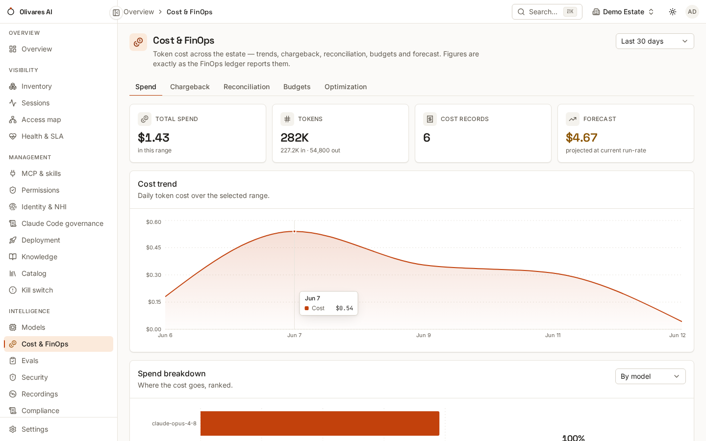

Claude Code telemetry tells you what runs on developer machines. The
**Anthropic admin plane** tells you what the *organization* does: billed
cost, per-workspace usage, org members and keys, the compliance activity
feed. Four read-only sources cover it; this page wires the two central ones
and summarizes their roster-side companions.

| Source (`kind`) | What it reads | Credential |
|---|---|---|
| `claude-api` | usage & billed cost, model/workspace inventory, Claude Code analytics, API-side MCP/server-tool governance | Admin API key (`admin_key`) |
| `claude-compliance` | the compliance activity feed (evidence-grade events) + the org directory | activity-feed key + a **distinct** Compliance Access Key |
| `claude-console` | org IAM roster (members, roles) → SSO/SCIM posture findings | console credentials |
| `claude-wif` | non-human identities (service accounts `svac_…`, federated identities) + their **permitted** scope edges | WIF endpoint credentials |

All are **read-only and deny-closed**: an empty credential means that feed is
off and the product says so — never a fabricated empty inventory.

## `claude-api`: cost, usage and API-side governance

```json
{
  "sources": [{
    "name": "anthropic-org",
    "kind": "claude-api",
    "tenant": "<tenant-id>",
    "config": {
      "admin_key": "<admin-api-key-reference>",
      "cost_report": "true",
      "claude_code": "true"
    }
  }]
}
```

The keys that matter (from the shipped descriptor; defaults in parentheses):

* **`admin_key`** (secret) — the Anthropic Admin API key. Empty = offline
  catalog only.
* **`cost_report`** (`true`) — pull the **billed** cost report (daily,
  authoritative) alongside the derived usage estimate. The product keeps the
  two apart: estimates reconcile against billed figures, one source of cost
  per session, never both.
* **`lookback`** (`24h`) / **`cost_lookback`** (`48h`) /
  **`bucket_width`** (`1d`; also `1h`, `1m`) / **`max_pages`** — pull windows
  and pagination bounds.
* **`claude_code`** (`false`) — also pull the Claude Code Analytics feed
  (per-developer estimated cost by model) for chargeback.
* **`claude_code_shadow_auth`** (`true`) — with the analytics feed on, flag
  each developer whose Claude Code usage bills as `customer_type=api` — a
  personal/API key **outside the org subscription**, i.e. identity and spend
  riding an ungoverned key. Set `false` only if your org intentionally runs
  Claude Code on API billing.
* **`gateway`** (`direct`) — the deployment surface this org runs on
  (`direct | claude-platform-aws | bedrock-mantle | bedrock-legacy | vertex |
  foundry`). On a surface without the Admin API (Bedrock/Vertex/Foundry) the
  governance ingest **degrades honestly with a posture finding** instead of
  pretending an empty inventory.
* **`mcp_toolsets`** / **`server_tool_grants`** — operator-declared
  allow-sets for API-driven Claude agents (which MCP tools, which Anthropic
  server-tool types an agent *may* use). Each allowed entry becomes a
  **permitted edge** in module III, crossed against observed access — the
  same permitted-vs-observed diff as everywhere else. The `agent_ref` must be
  the agent's external id as discovered at runtime, or the grant is an honest
  no-op rather than a false match.

:::caution[The analytics feed has a named boundary]
The Claude Code Analytics feed only tracks usage on the **Claude API**.
Fleets on Claude Platform on AWS, Bedrock, Gemini Enterprise Agent Platform (formerly Vertex AI) or Microsoft Foundry are
**not in it** — absence of findings there is not evidence of absence. For
those surfaces the [OTel plane](/2026-06/how-to/claude-code-enterprise-otel/) is the
observation you have.
:::

## `claude-compliance`: the evidence feed and the directory

```json
{
  "sources": [{
    "name": "anthropic-compliance",
    "kind": "claude-compliance",
    "tenant": "<tenant-id>",
    "config": {
      "api_key": "<activity-feed-key-reference>",
      "compliance_access_key": "<compliance-access-key-reference>"
    }
  }]
}
```

Two **distinct** credentials, deliberately:

* **`api_key`** — an Admin API key with `read:compliance_activities`; pulls
  the activity feed (evidence-grade events).
* **`compliance_access_key`** — a separate key with
  `read:compliance_org_data` / `read:compliance_user_data`; enables the org
  **directory** ingest (orgs, users, roles, groups — including the
  SCIM-provisioning signal the Admin API cannot see). Empty = directory off,
  deny-closed.

The deletion scope (`delete:compliance_user_data`, used by the right-to-
erasure path) is provisioned separately and dual-control gated — this read
connector never holds it.

## What you'll see in the console

Billed and estimated spend, sliced by the dimensions the telemetry carries
(team and project labels become first-class), in **Cost & FinOps**; org
members, non-human identities and their scopes in **Identity & NHI**; posture
findings (shadow auth, surface degradation, WIF footguns) in **Security**:



## Honest limits

* **Cost authority is the billed report.** Usage-derived figures are
  estimates and are reconciled, never double-counted.
* **The admin plane sees Anthropic-operated surfaces.** Third-party-hosted
  Claude (Bedrock/Vertex/Foundry) is invisible to it — named explicitly via
  `gateway`, covered by the OTel plane.
* **`claude-console` posture findings include a blind spot:** the console
  cannot observe whether SSO/SCIM is enforced upstream — the finding says so
  rather than guessing.

## Related

* [Enterprise OTel for Claude Code](/2026-06/how-to/claude-code-enterprise-otel/) —
  the per-session plane these org-level feeds complement.
* [Budgets & FinOps guardrails](/2026-06/how-to/cookbook/budgets-and-finops-guardrails/)
  — turn the cost stream into enforced limits.
* [Connectors & coverage tiers](/2026-06/reference/connectors/) — the full catalog.
