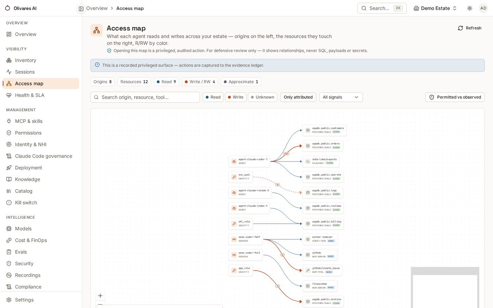

The `s3cloudtrail` source turns AWS CloudTrail **S3 data events** into
access-map edges: one edge per S3 event, with the read/write mode taken
**verbatim from CloudTrail's `readOnly` field** — never inferred — and the IAM
principal CloudTrail attributes the call to as the origin. It is the clean
tier for object storage, the S3 counterpart of
[pgAudit](/2026-06/how-to/connectors/pgaudit/) for Postgres.

The connector **reads local log files and never calls AWS**: you deliver the
CloudTrail files (the standard S3-delivery layout your trail already
produces), it parses them. Only `eventSource == s3.amazonaws.com` events are
processed — management-plane events belong to the
[`aws` cloud-discovery connector](/2026-06/reference/connectors/), not this one.

## What it emits

| Field | Value |
|---|---|
| Signal source | `cloudtrail` |
| Mode | `readOnly: true` → `read`, `false` → `write`, absent → `unknown` — verbatim, never guessed |
| Origin | the IAM principal (user, assumed-role session, AWS service) |
| Confidence | `attributed`; `approximate` for shared assumed roles and service-invoked calls |
| Coverage tier | clean |

## 1. AWS-side prerequisites

* A CloudTrail **trail with S3 data events enabled** for the buckets you
  govern (data events are not in the default management trail).
* Delivery of the trail's log files to a location the engine host can read —
  the standard S3 delivery bucket, synced or mounted locally. The connector
  accepts the classic `{"Records":[…]}` files (plain or `.json.gz`) and
  newline-delimited records.

## 2. Declare the source

```json
{
  "sources": [{
    "name": "prod-s3-trail",
    "kind": "s3cloudtrail",
    "tenant": "<tenant-id>",
    "config": {
      "path": "/var/lib/cloudtrail/prod/",
      "shared_accounts": "arn:aws:iam::123456789012:role/app-runtime"
    }
  }]
}
```

| Key | Required | Meaning |
|---|---|---|
| `path` | yes | one CloudTrail file, or a directory of `*.json` / `*.json.gz` files |
| `shared_accounts` | no | comma-separated role ARNs that many callers share — their edges are honestly `approximate` |

(`s3-cloudtrail` is accepted as an alias for the `kind`.)

## 3. What you'll see in the console

S3 buckets and objects join the **Access map** with clean-tier badges; reads
and writes are colored from the `readOnly` flag. The drift panel crosses them
against declared grants exactly as for any other source:



In **Inventory**, the principals CloudTrail attributes calls to appear as
identities, ready to be bound to agents — that binding is what turns a
shared-role `approximate` into a per-agent `attributed`.

## Honest limits — read these before trusting the map

* **An assumed role shared by many callers cannot name the real caller.**
  CloudTrail attributes the call to the role session; if the role is shared,
  the edge is deliberately `approximate`. Declaring the role in
  `shared_accounts` makes that explicit. The durable fix is per-agent
  identity ([the identity dependency](/2026-06/how-to/connect-a-source/#the-hard-dependency-per-agent-identity)).
* **Data events you did not enable do not exist.** CloudTrail only records
  what the trail is configured to record; absence of an edge is not absence
  of access if data events are off for a bucket.
* **Delivery latency is CloudTrail's.** Data events arrive on CloudTrail's
  delivery schedule (typically minutes); this source is not a real-time tap.

## Related

* [pgAudit](/2026-06/how-to/connectors/pgaudit/) — the same clean-tier discipline for
  PostgreSQL.
* [Connect a source](/2026-06/how-to/connect-a-source/) — the connector model.
* [Connectors & coverage tiers](/2026-06/reference/connectors/) — where every store
  honestly sits.
