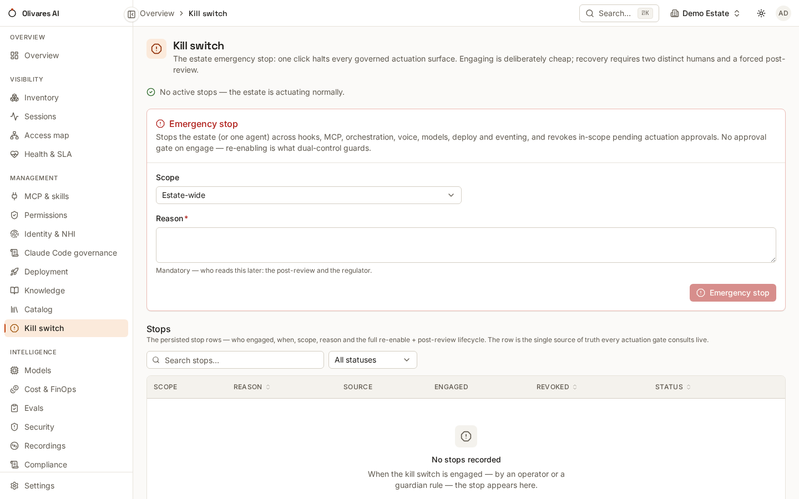

**Goal:** when an agent goes wrong at machine speed, stop it — or everything
— *now*, with one authenticated call, and lift the stop later under dual
control with the whole incident on the record.

The asymmetry is the design: **engaging is fast** (admin-tier, no approval
gate — an emergency stop must never wait in a queue), **re-enabling is slow**
(two distinct humans, and the incident leaves an evidence pack for post-review). There is deliberately
no break-glass around the stop: stopped *is* the safe state.

## Engage

```bash
# Stop the whole estate:
curl -ks -X POST "$BASE/v1/m/governance/killswitch" \
  -H "Authorization: Bearer $ADMIN_TOKEN" -H "X-Olivares-Tenant: $TENANT" \
  -H 'Content-Type: application/json' \
  -d '{"scope_kind":"estate","reason":"runaway agent incident #1234"}'

# Or stop one agent (by UUID or external id):
curl -ks -X POST "$BASE/v1/m/governance/killswitch" \
  -H "Authorization: Bearer $ADMIN_TOKEN" -H "X-Olivares-Tenant: $TENANT" \
  -d '{"scope_kind":"agent","scope_ref":"agent:billing-reconciler","reason":"…"}'
```

What stops, immediately and fail-closed: the governed **actuation** surfaces
— `claude.tool.use`, `mcp.tool.call`, `deploy.apply`, `deploy.retire`,
`orchestration.schedule.fire`, `voice.session.open`. Pending actuation
approvals in scope are **cancelled in the same transaction**, so nothing
approved-but-not-yet-run slips through after the stop.

What deliberately does *not* stop: observation, and governance itself
(findings, identity lifecycle, compliance) — you can still see and govern
while stopped. Re-engaging an already-stopped scope returns `409` (it is
idempotent on the scope, not a stack).

```bash
# Live posture — is anything stopped right now?
curl -ks "$BASE/v1/m/governance/killswitch/state" \
  -H "Authorization: Bearer $TOKEN" -H "X-Olivares-Tenant: $TENANT"
```

Guardian rules can engage the same stop automatically (`stop_agent` /
`stop_estate` actions) when a containment rule fires — the auto-path and the
human path are the same gate, and an auto-stop emits a CRITICAL finding.

## Re-enable (dual control)

```bash
curl -ks -X POST "$BASE/v1/m/governance/killswitch/$STOP_ID/reenable" \
  -H "Authorization: Bearer $TOKEN" -H "X-Olivares-Tenant: $TENANT" \
  -d '{"reason":"root cause fixed: …"}'
```

This **opens an approval**, never lifts the stop directly. The action is
pre-classified CRITICAL: **two distinct human approvers**, strong (AAL3)
authentication per decision — and the two-human floor is structural, enforced
in the transaction even if an approval policy tries to downgrade the tier.
The requester cannot be a decider; a rejected or expired request opens a
fresh quorum.

After re-enable, a **post-review** by yet another human (different from the
engager, the requester *and* the re-enablers) closes the incident — until it
is recorded, the same scope cannot be stopped-and-re-enabled again without
review:

```bash
curl -ks -X POST "$BASE/v1/m/governance/killswitch/$STOP_ID/review" … 
curl -ks "$BASE/v1/m/governance/killswitch/$STOP_ID/evidence"   # the evidence pack
```

The evidence endpoint returns the incident's pack — the stop, the cancelled
approvals, the decisions and the trail — ready for the auditor.

## The console

**Kill switch** in the Management section is the one-click version of the
same gate, with the live state and the re-enable flow:



## Drill it

A kill switch you have never pulled is a hypothesis. Quarterly, in a
maintenance window:

1. Engage an **agent-scoped** stop on a low-stakes agent; verify its tool
   calls deny and the finding fires.
2. Walk the re-enable: two approvers, post-review, evidence pack pulled and
   archived.
3. Time the loop end to end — that number is your real containment latency,
   and the drill leaves a complete ledger trail to show for it.
